<div align="center">
  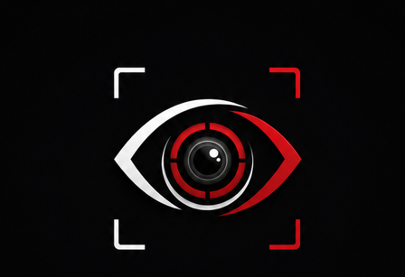
  <h1>Virtual Guard</h1>
  <p><strong>AI-assisted retail surveillance with human-controlled incident review</strong></p>
  <p>React · Spring Boot · FastAPI · PostgreSQL · YOLO · OpenCV</p>
</div>

> [!IMPORTANT]
> Virtual Guard is a decision-support prototype. It flags video for a trained human reviewer; it does not identify guilt or prove that an offence occurred.

## Problem and approach

Retail security teams may be responsible for several camera feeds at once. Important events may only become clear after an interaction between a person, bag, basket and product develops over time. Basic motion alarms create noise, while an automatic accusation would be unsafe.

Virtual Guard turns surveillance clips into structured review cases:

1. A guard assigns a clip to a store camera.
2. The platform validates and samples the video.
3. Computer vision detects people, bags, baskets and products.
4. Tracking and temporal feature extraction summarize movement.
5. A classifier produces a behaviour label, confidence and suspicion score.
6. Suspicious results become incidents—not final judgements.
7. An authorized officer confirms, dismisses or escalates the incident.
8. The map, notifications, reports, history and analytics reflect the decision.

This keeps human accountability at the centre of the system.

## Architecture

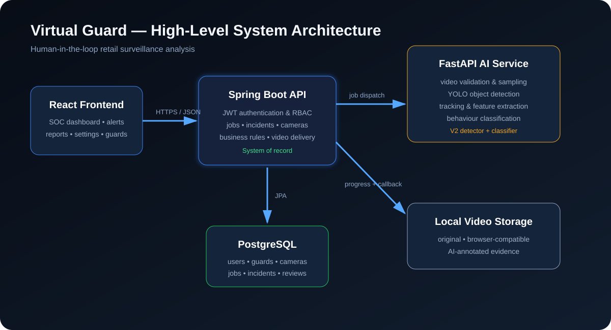

The Spring Boot backend is the source of truth. The browser never calls FastAPI or PostgreSQL directly, and FastAPI never writes directly to the database.

### Engineering highlights

- Clear separation between the React interface, Spring Boot domain API, FastAPI inference service and PostgreSQL persistence.
- Asynchronous video jobs with progress reporting, bounded service calls and idempotent result handling.
- JWT authentication, role-based authorization and a separate API key for internal callbacks.
- Human-in-the-loop decisions with searchable reports, audit history and evidence playback.
- Reproducible detector evaluation with preserved metrics, plots and model configuration.
- Automated frontend and backend checks through GitHub Actions.

| Component | Responsibility | Default address |
|---|---|---|
| React frontend | Monitoring, uploads, maps, reviews, analytics and administration | `http://localhost:5173` |
| Spring Boot | Auth, authorization, jobs, incidents, video access and persistence | `http://localhost:8090` |
| FastAPI | Video validation, detection, tracking, annotation and behaviour prediction | `http://localhost:8000` |
| PostgreSQL | Users, guards, cameras, jobs, incidents and review state | `localhost:5432` |
| Local storage | Original, browser-compatible and annotated videos | `backend/uploads/` |

## Frontend

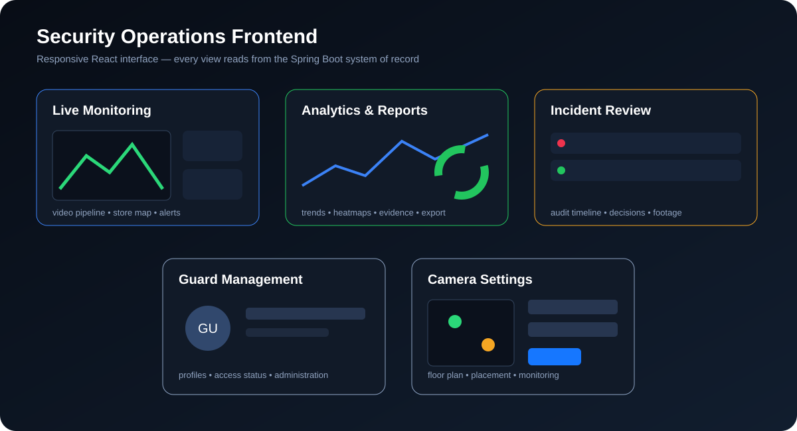

- **Live Monitoring:** camera uploads, pipeline progress, annotated playback, alert audio and store map.
- **Analytics:** totals, trends, outcomes, camera activity, heatmaps and CSV export.
- **Reports:** searchable master-detail records, evidence and officer decisions.
- **Review History:** status tabs, audit timeline, expandable details and export.
- **Security Guards:** profiles, access status, activation and deactivation.
- **Settings:** camera registration, monitoring and floor-plan placement.

### Product tour

<details open>
<summary><strong>Live monitoring and store map</strong></summary>

Monitor camera feeds, analysis stages, processing progress and camera locations from one operations view.

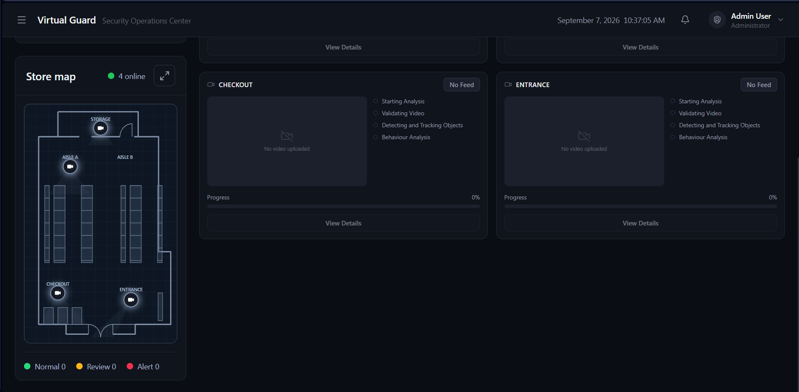

</details>

<details>
<summary><strong>Analytics dashboard</strong></summary>

Review incident trends, outcomes, camera activity, risk by time and automatically generated operational insights.

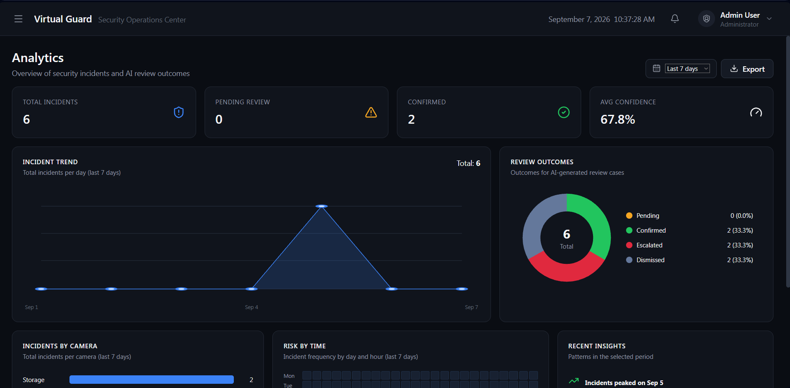

</details>

<details>
<summary><strong>Incident reports</strong></summary>

Search incident records, inspect AI scores and evidence, record investigation notes, and submit an officer decision.

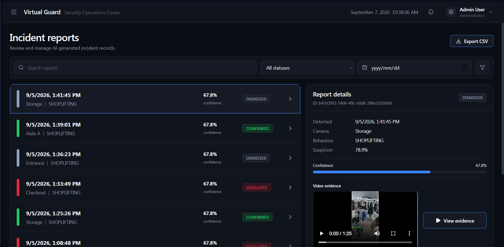

</details>

<details>
<summary><strong>Incident review history</strong></summary>

Use the audit timeline to trace confirmed, dismissed and escalated reviews by camera, reviewer and date.

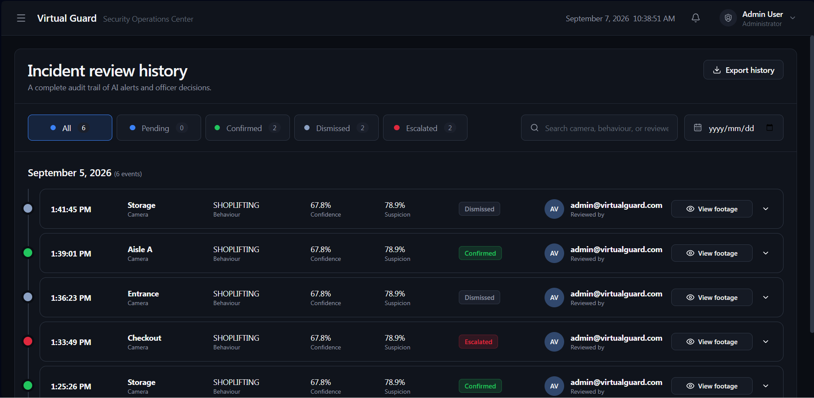

</details>

<details>
<summary><strong>Security guard administration</strong></summary>

Administrators can search guard profiles and manage account access and badge information.

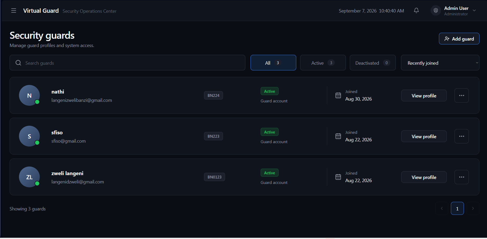

</details>

<details>
<summary><strong>Camera settings</strong></summary>

Configure monitoring state and camera placement against the same floor plan used by live operations.

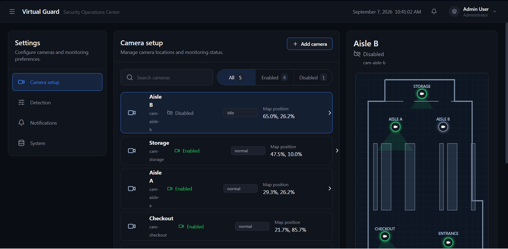

</details>

## How services communicate

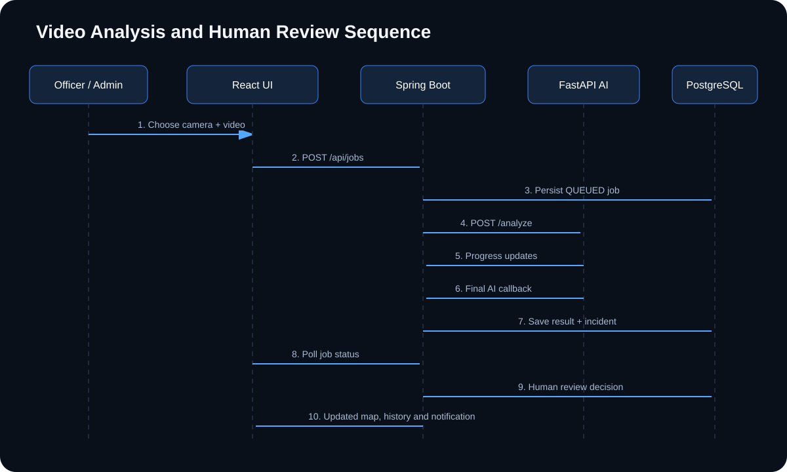

Analysis is asynchronous from the user’s perspective. Uploading creates a job, starting analysis dispatches it to FastAPI, and the UI polls Spring Boot for progress. FastAPI sends API-key-protected progress updates and a final callback.

```text
queued → validating-video → vision-analysis → behaviour-analysis → complete
                                                            ↘ failed
```

## AI pipeline

```text
Video
  └─ validation / browser conversion
      └─ frame sampling
          └─ YOLO detection: bag, basket, people, product
              └─ lightweight object tracking
                  └─ temporal feature extraction
                      └─ behaviour classifier
                          ├─ behaviour and confidence
                          ├─ suspicion score
                          └─ annotated evidence video
```

The detector is selected with `VISION_MODEL=v2`. The current tracker is intentionally lightweight; stronger tracking through occlusion is future work.

### V2 training evidence

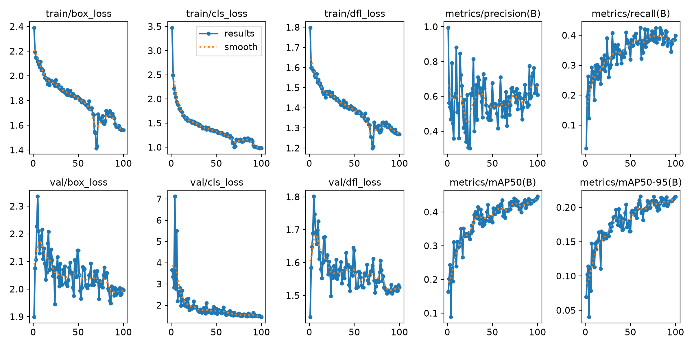

Precision, recall, F1, confusion matrices, weights and training history are preserved in [`ai-service/runs/detect/virtual_guard_mall_detector_v2`](ai-service/runs/detect/virtual_guard_mall_detector_v2).

## Repository layout

```text
virtual-guard-v1/
├── frontend/       React + TypeScript operations console
├── backend/        Spring Boot API and persistence
├── ai-service/     FastAPI inference, models, datasets, scripts and tests
├── docs/images/    Portable diagrams used by this README
├── uploads/        Prototype analysis artifacts
├── docker-compose.yml
└── .env.example
```

## Prerequisites

- Node.js 20+
- JDK 17 and Maven 3.9+
- Python 3.11–3.13
- PostgreSQL 16, or Docker Desktop
- Optional NVIDIA CUDA GPU

Avoid Python 3.14 because some computer-vision packages may not yet provide compatible wheels.

## Local setup (Windows PowerShell)

### 1. Configuration

```powershell
Copy-Item .env.example .env
```

Replace every placeholder in `.env`. Never commit this file. Use separate random values for `JWT_SECRET`, `INTERNAL_API_KEY` and `DB_PASSWORD`.

```powershell
[Convert]::ToBase64String([Security.Cryptography.RandomNumberGenerator]::GetBytes(48))
```

### 2. PostgreSQL

```powershell
docker compose up -d postgres
docker compose ps
```

### 3. AI service

```powershell
cd ai-service
py -3.13 -m venv venv313
.\venv313\Scripts\Activate.ps1
python -m pip install --upgrade pip
python -m pip install -r requirements.txt
python -m uvicorn app.main:app --reload --port 8000
```

Health check: `Invoke-RestMethod http://localhost:8000/health`

### 4. Backend

```powershell
cd backend
mvn spring-boot:run
```

If `JAVA_HOME` fails, point it to the JDK—not its `bin` folder:

```powershell
$env:JAVA_HOME = 'C:\Program Files\Java\jdk-17'
$env:Path = "$env:JAVA_HOME\bin;$env:Path"
mvn -version
```

Health check: `Invoke-RestMethod http://localhost:8090/api/health`

### 5. Frontend

```powershell
cd frontend
npm install
npm run dev
```

Open `http://localhost:5173`.

## Development accounts

Accounts are bootstrapped only when:

```dotenv
BOOTSTRAP_USERS_ENABLED=true
BOOTSTRAP_PASSWORD=choose-a-strong-local-password
```

- `admin@virtualguard.com` — administrator
- `guard@virtualguard.com` — security guard

Never enable predictable bootstrap credentials in production.

## Important API routes

| Method | Route | Purpose |
|---|---|---|
| `POST` | `/api/auth/login` | Issue authentication tokens |
| `POST` | `/api/auth/refresh` | Refresh authentication |
| `GET` | `/api/cameras` | Camera configuration and status |
| `POST`, `PUT` | `/api/cameras`, `/api/cameras/{id}` | Create/update camera |
| `POST` | `/api/jobs` | Upload video and create job |
| `POST` | `/api/jobs/{id}/start` | Dispatch analysis |
| `GET` | `/api/jobs`, `/api/jobs/{id}` | Restore/poll jobs |
| `GET` | `/api/video/{fileName}` | Stream authenticated evidence |
| `GET` | `/api/incidents` | Query incidents and history |
| `PATCH` | `/api/incidents/{id}/review?status=…` | Human review decision |
| `GET` | `/api/notifications/count` | Pending-review count |
| `POST` | `/internal/jobs/{id}/progress` | Protected AI progress callback |
| `POST` | `/internal/jobs/{id}/callback` | Protected AI result callback |

## Security boundaries

- Users authenticate with JWT bearer tokens and role-based access.
- Internal AI callbacks use a separate `X-API-Key`.
- Passwords are BCrypt-hashed.
- Upload size is limited to 500 MB.
- CORS is restricted through `CORS_ALLOWED_ORIGINS`.
- Videos are delivered through the authenticated backend.
- `.env`, dependencies, build outputs and caches are Git-ignored.

Production requires HTTPS, a secrets manager, rate limits, centralized logs, encrypted object storage, malware scanning and explicit retention policies.

## Verification

```powershell
# Frontend
cd frontend
npm run lint
npm run build

# Backend
cd ..\backend
mvn test

# AI service
cd ..\ai-service
.\venv313\Scripts\Activate.ps1
python -m pytest
```

## Models, datasets and cleanup

Keep model files, training datasets, experiment reports, `best.pt`, evaluation plots and evidence required by incidents. In particular, preserve:

- `ai-service/models/`
- `ai-service/runs/detect/virtual_guard_mall_detector_v2/weights/best.pt`
- `ai-service/runs/detect/virtual_guard_mall_detector_v2/results.csv`
- datasets required for retraining and reproducibility

Large datasets, local virtual environments, uploaded evidence, generated build output and model archives are intentionally excluded from Git. Deployable model files under `ai-service/models/` and selected evaluation evidence under `ai-service/runs/` remain part of the project. For long-term distribution, publish large versioned artifacts through GitHub Releases, Git LFS or an external model registry and record their checksums.

Safe generated artifacts include `__pycache__`, `.pytest_cache`, `backend/target`, `frontend/dist` and YOLO `*.cache` indexes. `frontend/node_modules` is reproducible but retained locally to avoid forcing another installation.

## Known limitations

- Uploaded clips simulate CCTV; continuous RTSP ingestion is not implemented.
- Local videos need a formal retention policy before production.
- Investigation notes are currently browser-local and should move to an immutable backend audit log.
- Dispatch does not yet use a durable external queue.
- Lightweight tracking may lose identity during long occlusions.
- Accuracy depends on representative camera angles, lighting and labeled data.
- A high suspicion score is a review priority, not proof of wrongdoing.

## Roadmap

- PostgreSQL-backed investigation notes and audit events
- Live RTSP ingestion and SSE/WebSocket progress
- Durable queue, retries and dead-letter handling
- Encrypted object storage and automated retention
- Stronger multi-object tracking and model-drift monitoring
- Face blurring and least-privilege evidence access
- Containerized deployment, observability and CI/CD scanning

## Responsible use

Deploy only with visible policy, trained reviewers, access controls and an escalation process. Reviewers must consider full video context and must not treat model output as an accusation. Evaluate false positives, false negatives and uneven performance across real store environments before operational use.

## More documentation

- [Extended architecture reference](docs/architecture.md)
- [Backend notes](backend/README.md)
- [Mall detector training report](ai-service/PHASE5_README.md)
- [Model artifact notes](models/README.md)

## License

The project source is licensed under the [MIT License](LICENSE). Third-party libraries, datasets and model artifacts retain their respective licenses.
