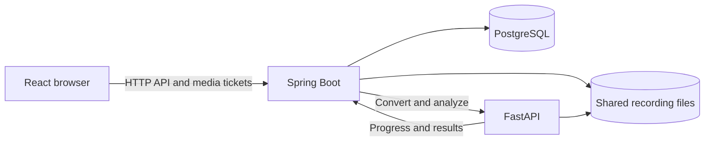

# Virtual Guard

Virtual Guard is an AI-assisted retail surveillance and incident-review platform. It processes uploaded recordings, overlays detections, tracks and human poses, and presents model-flagged incidents for human review.

## Overview

The application connects a React operations interface to a Spring Boot API, PostgreSQL metadata storage and a FastAPI inference service. Camera records organize uploaded footage; they do not establish live CCTV connections. Model predictions support investigation and are not proof of theft.

## Key features

- Upload recordings against a monitored camera, start analysis and follow job progress.
- Replay browser-compatible footage with object boxes, per-video track IDs and pose overlays.
- Review incidents, save investigation notes, confirm, dismiss or escalate a case.
- Use one incident workspace for records, review history, trends and CSV exports.
- Configure camera labels, monitoring status and map positions.
- Administer guard profiles and account status, reset guard passwords and require a password change.
- Run all four services with Docker Compose.

## System architecture


```mermaid
flowchart LR
    Browser[React browser] -->|HTTP API and media tickets| Backend[Spring Boot]
    Backend --> DB[(PostgreSQL)]
    Backend -->|Convert and analyze| AI[FastAPI]
    AI -->|Progress and results| Backend
    Backend --> Media[(Shared recording files)]
    AI --> Media
```

See [Architecture](docs/ARCHITECTURE.md) for the sequence, security boundaries and source references.

## Technology stack

| Layer | Implementation |
|---|---|
| Frontend | React, TypeScript, Vite, Tailwind CSS; Nginx in Docker |
| Backend | Java 17, Spring Boot, Spring Security, Spring Data JPA |
| Persistence | PostgreSQL 16; local files for recordings |
| AI | Python, FastAPI, Ultralytics YOLOv8, PyTorch, OpenCV |
| Behaviour model | scikit-learn Random Forest and StandardScaler |
| Execution | Docker Compose; CPU inference in the supplied AI image |

## Computer vision and machine learning

The configured V2 detector recognizes `bag`, `busket`, `people` and `product`. The label `busket` retains the dataset spelling. An IoU tracker assigns IDs within each video. YOLOv8 pose estimation adds human keypoints on sampled frames containing detected people.

A separate classifier samples whole-frame motion and predicts `normal` or `shoplifting` from 14 statistics. **It does not consume detection boxes, track IDs or pose features.** Confidence, the heuristic suspicion score and the human review outcome are separate concepts.

## How video analysis works

1. Upload a recording; the backend stores it, requests browser conversion and saves a queued job.
2. Explicitly start the job. The backend claims an analysis attempt and dispatches it to FastAPI.
3. FastAPI runs sampled detection, tracking and pose, writes annotated footage, then runs the independent behaviour classifier.
4. FastAPI sends progress and result callbacks. Spring Boot persists the result and creates an incident for a `shoplifting` prediction.
5. The browser polls job state and displays authorized footage and review controls.

## Roles and security

Both `ADMIN` and `SECURITY_GUARD` can use recording analysis and incident review. Administrators additionally manage cameras and guards. The backend enforces these permissions.

Passwords use BCrypt. Access/refresh JWTs are checked against current account state; guard password resets revoke existing sessions and force a password change. Media playback requires a short-lived filename-bound ticket. Internal AI calls use a shared API key. Secrets belong in local environment configuration, never in version control.

## Quick start

Prerequisites: Docker Desktop with Linux containers, Docker Compose, and the supplied model artifacts in `ai-service/models/`.

From the repository root, in PowerShell:

```powershell
Copy-Item .env.example .env   # Only if .env does not already exist
```

Configure private database credentials, a Base64 JWT secret, an internal API key and bootstrap credentials as described in [Setup](docs/SETUP.md). Then:

```powershell
docker compose up -d --build
docker compose ps
```

The default frontend is http://localhost:8080; backend and AI health endpoints use ports 8090 and 8000. Local overrides may change host ports. Existing users retain their passwords when bootstrap settings change.

## Testing

Run in the indicated service directory:

| Directory | Commands |
|---|---|
| `frontend` | `npm ci`, `npm run build`, `npm run lint`, `npm test` |
| `backend` | `mvn test` |
| `ai-service` | `python -m pip install -r requirements-dev.txt`, `python -m pytest tests -q` |
| Repository root | `docker compose config --quiet` |

Activate the configured Python environment first. Database tests require explicit opt-in configuration; browser and live integration checks are documented in [Setup](docs/SETUP.md#verification).

## Model performance

| Saved evidence | Result | Interpretation |
|---|---|---|
| V2 detector comparison | mAP50 0.4755; mAP50-95 0.2235 | Four-class held-out test split; saved acceptance decision is **REJECTED** |
| Behaviour evaluation | 82.14% accuracy on 28 stored-feature samples | Original training/test separation is not established |

V2 is selected by the supplied configuration despite the historical rejection. These figures are not end-to-end theft-detection accuracy. [Model evaluation](docs/MODEL_EVALUATION.md) explains the criteria, different V1 evaluations, best V2 epoch and evidence limitations.

## Project structure

```text
frontend/       Browser UI and frontend tests
backend/        API, authentication, persistence and backend tests
ai-service/     Inference, models, datasets, training/evaluation tools and tests
scripts/        Packaging and opt-in integration verification
docs/           Architecture, setup and model evidence
docker-compose.yml
.env.example    Placeholder configuration
```

Datasets, runtime uploads and local environments may exist locally without being tracked. Models must be supplied before inference; no training is required for startup.

## Current limitations

- Uploaded-video processing, not live CCTV ingestion or continuous real-time monitoring.
- Simple per-video IoU association; no ReID, cross-camera tracking or concealment reasoning.
- Experimental detector quality and a small behaviour evaluation; false positives and false negatives require human review.
- CPU processing, repeated video passes and an in-memory task queue limit throughput and resilience.
- LocalStorage tokens, local media storage, no MFA, tenant isolation or configured public TLS deployment.
- No Kafka, Kubernetes deployment, durable job broker or automated enforcement action.

## Documentation

- [Architecture](docs/ARCHITECTURE.md)
- [Setup and operations](docs/SETUP.md)
- [Model evaluation and limitations](docs/MODEL_EVALUATION.md)

The packaging script excludes private configuration, recordings, environments and build outputs. Review redistribution rights for datasets and model artifacts before sharing a package.

## License

Project source is provided under the [MIT License](LICENSE). Third-party libraries, datasets and pretrained model artifacts retain their own licenses and attribution requirements.
