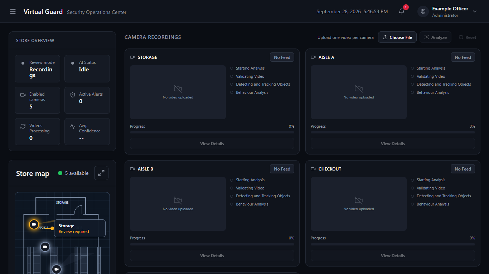
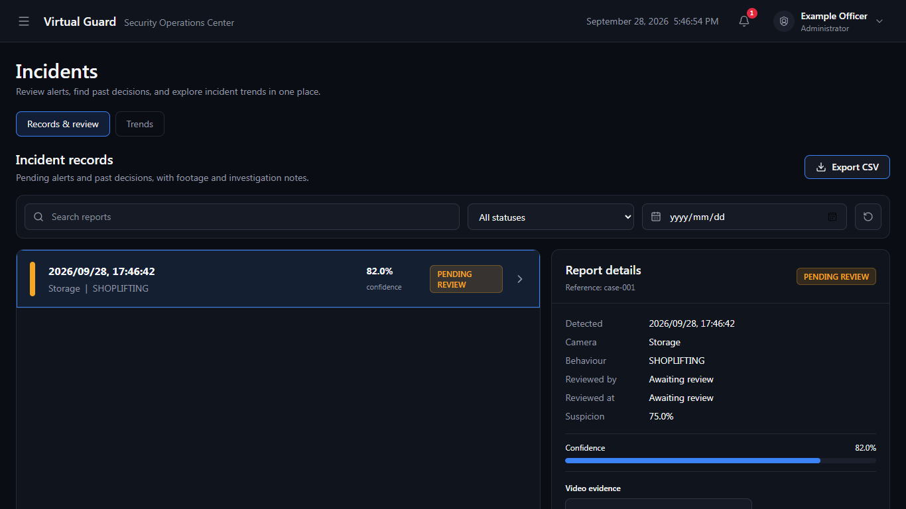
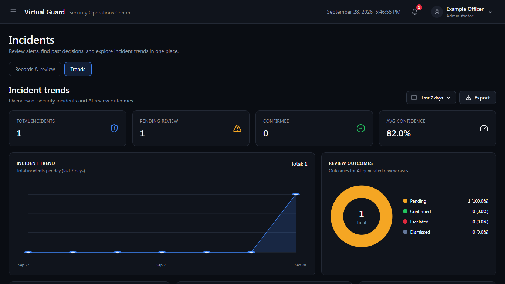
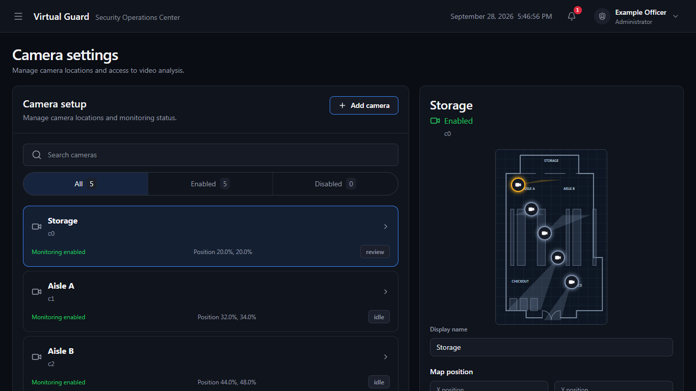
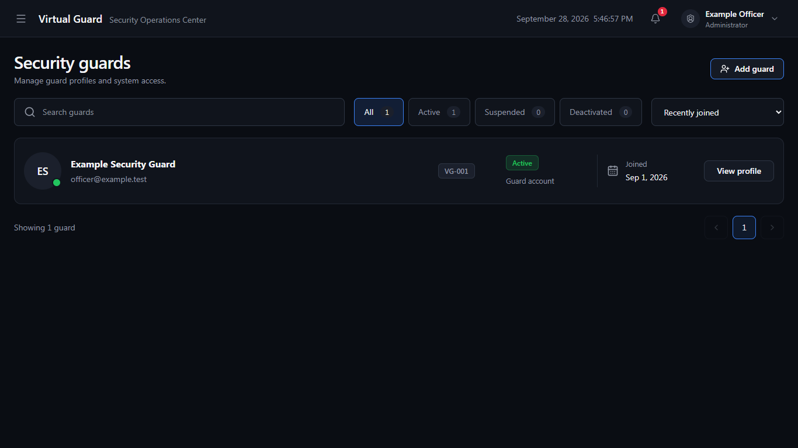
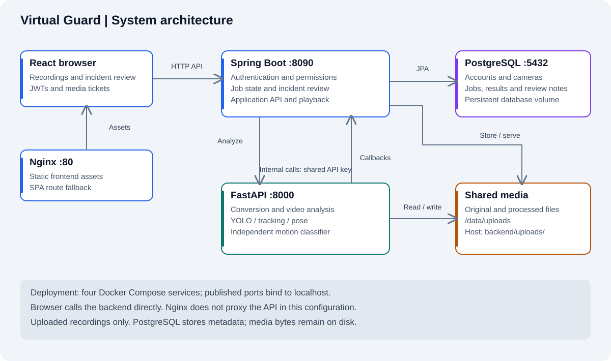
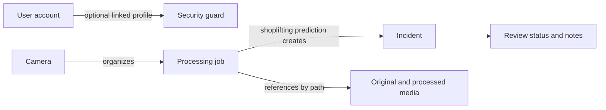
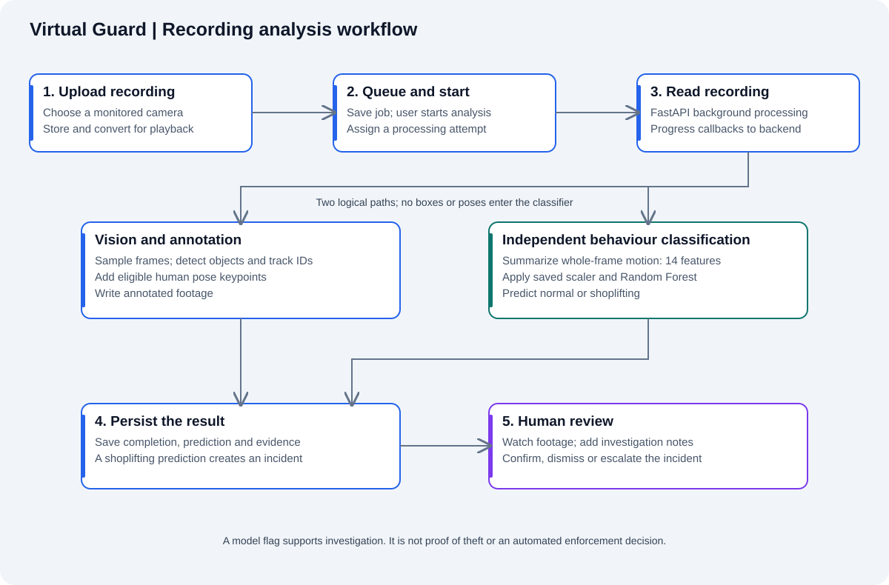
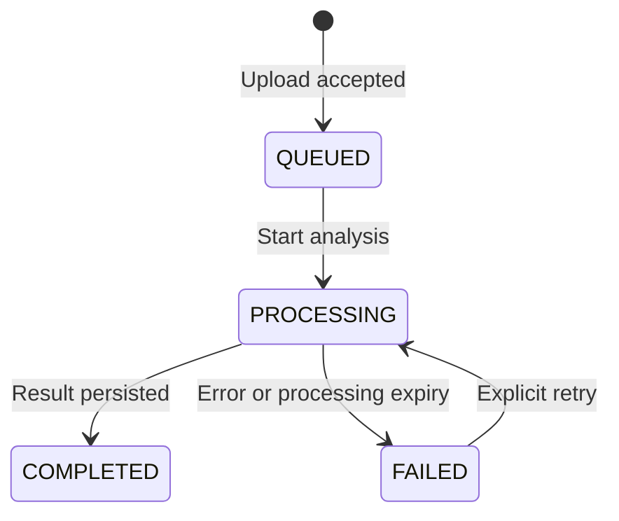

# Virtual Guard

Virtual Guard is an AI-assisted retail surveillance and incident-review platform. It processes uploaded recordings, overlays detections, tracks and human poses, and presents model-flagged incidents for human review.

## The problem

Retail security teams need to review recordings from different areas of a store, identify events worth investigating, and keep a clear record of what they decided. Reviewing footage manually takes time, especially when the reviewer must move between recordings, camera information and separate investigation notes. A recording alone also does not provide a structured incident history or show which cases still need attention.

Virtual Guard explores how computer vision and a shared review workspace can support that process. It brings uploaded recordings, analysis progress, annotated playback and human decisions into one application. The intended benefit is to help reviewers organize their work and locate material for investigation; a reduction in review time or retail losses has not been measured.

An AI flag is a prompt to investigate, not a finding of wrongdoing. Ordinary actions, occlusion and camera conditions can produce misleading predictions. A person remains responsible for interpreting the recording and deciding the review outcome.

## Project objectives

- Provide one workflow from recording upload to a documented incident decision.
- Add visual context through object detections, local track IDs and human pose overlays.
- Separate machine predictions from human review status and investigation notes.
- Give administrators control over camera metadata and security-guard accounts.
- Keep application responsibilities separate across a browser interface, API, inference service and database.
- Make local setup reproducible and document model evidence and limitations openly.

## Contents

- [Overview](#overview)
- [Key features](#key-features)
- [Application screenshots](#application-screenshots)
- [System architecture](#system-architecture)
- [Technology stack](#technology-stack)
- [Computer vision and machine learning](#computer-vision-and-machine-learning)
- [How video analysis works](#how-video-analysis-works)
- [Roles and security](#roles-and-security)
- [Quick start](#quick-start)
- [Testing](#testing)
- [Model performance](#model-performance)
- [Project structure](#project-structure)
- [Current limitations](#current-limitations)
- [Future development](#future-development)
- [Documentation](#documentation)

## Overview

The application connects a React operations interface to a Spring Boot API, PostgreSQL metadata storage and a FastAPI inference service. Camera records organize uploaded footage; they do not establish live CCTV connections. Model predictions support investigation and are not proof of theft.

## Key features

### Recording management and progress

Choose a monitored camera, upload a recording and explicitly start its analysis. The dashboard shows camera context and job state so an operator can follow queued, processing, completed and failed work. The backend requests browser-compatible conversion before analysis; uploads are limited to 500 MB by the supplied backend configuration. Failed work can be retried explicitly.

Camera records group recordings by location. They contain labels, monitoring settings and map positions. Storing a camera stream URL does not connect the application to a live feed.

### Annotated evidence playback

Review processed footage with object boxes, class labels, per-video tracking IDs and eligible human pose overlays. Original and processed media are served through authorized playback routes. Experimental review segments may be available for flagged clips; full footage remains available when segment generation fails.

Tracking IDs help follow detections within one recording. They do not identify a person or link people between cameras.

### Incident records and investigation

A completed analysis with a `shoplifting` prediction creates an incident for review. The incident workspace brings together records, filtering, evidence, investigation notes and past decisions. Reviewers can confirm, dismiss or escalate a case. A normal prediction remains in the job history without creating an incident.

The human review outcome is stored separately from the model prediction. Confirming a case records a review decision; it does not trigger an external enforcement action.

### Incident trends and exports

The Trends view summarizes flagged incidents, while CSV exports support further reporting. These summaries describe the incidents recorded by the application, not total store traffic, every analyzed recording or a measured theft rate. Notification counts reflect incident state within the application.

### Camera and guard administration

Administrators can manage camera labels and monitoring configuration, position cameras on the store map, and maintain guard profiles and account status. Guard administration includes creating and editing profiles, suspending or reactivating access, and resetting a linked guard account's password.

A reset invalidates existing sessions and requires the guard to choose a new password before returning to ordinary application features. Both administrators and guards can change their own passwords.

### Local full-stack deployment

Docker Compose starts the frontend, backend, AI service and PostgreSQL with health checks and persistent storage. Model artifacts are supplied separately from application dependencies; startup does not require training a model. Private configuration stays in local environment files.

## Application screenshots

The screenshots below show the current React interface with synthetic demonstration records supplied by the browser test fixture. They illustrate the interface, not a live surveillance installation or measured model results.

### Recording dashboard



The dashboard organizes camera recordings and analysis work by store area. Camera cards represent uploaded-recording workflows rather than live CCTV streams.

### Incident review workspace



Records and review history share one workspace, allowing an operator to find cases and continue an investigation.

### Incident trends



Trends summarize flagged incidents. The demonstration counts are fixture data and are not evaluation statistics.

### Administration

| Camera settings | Security guards |
|---|---|
|  |  |

Administrators manage camera configuration and guard access through dedicated views.

## System architecture



### Service responsibilities

| Component | Responsibility | Main connections |
|---|---|---|
| React browser | Authentication screens, recording uploads, progress polling, playback and incident review | Calls the Spring Boot API directly |
| Nginx | Serves the built frontend and handles single-page application fallback | Delivers browser assets; is not an API reverse proxy in this setup |
| Spring Boot | Authentication, role enforcement, camera/guard management, job lifecycle and incident persistence | PostgreSQL, FastAPI and shared media files |
| FastAPI | Video conversion, detection, tracking, pose overlays and behaviour classification | Reads/writes shared media; sends progress and completion callbacks |
| PostgreSQL | Stores accounts, camera metadata, job state, results and incident review information | Accessed by the backend |
| Shared recording directory | Stores original, converted and annotated video files | Mounted into both processing services as `/data/uploads` |

The backend owns application state; the AI service performs processing. Video bytes live on disk rather than in database blobs. Internal service calls use a shared API key. The browser uses access tokens for API requests and short-lived, filename-bound tickets for video playback.

### Data relationships


```mermaid
flowchart LR
    Account[User account] -->|optional linked profile| Guard[Security guard]
    Camera[Camera] -->|organizes| Job[Processing job]
    Job -->|shoplifting prediction creates| Incident[Incident]
    Incident --> Review[Review status and notes]
    Job -->|references by path| Media[Original and processed media]
```

This is a conceptual relationship diagram. Review notes and structured evidence are stored as metadata; the boxes do not each imply a separate database table. There is no tenant-level or per-case ownership isolation.

See [Architecture](docs/ARCHITECTURE.md) for source references, callback rules, security boundaries and deployment details.

## Technology stack

| Layer | Implementation |
|---|---|
| Frontend | React, TypeScript, Vite, Tailwind CSS; Nginx in Docker |
| Backend | Java 17, Spring Boot, Spring Security, Spring Data JPA |
| Persistence | PostgreSQL 16; local files for recordings |
| AI | Python, FastAPI, Ultralytics YOLOv8, PyTorch, OpenCV |
| Behaviour model | scikit-learn Random Forest and StandardScaler |
| Execution | Docker Compose; CPU inference in the supplied AI image |

## Computer vision and machine learning

The configured V2 detector recognizes `bag`, `busket`, `people` and `product`. The label `busket` retains the dataset spelling. An IoU tracker assigns IDs within each video. YOLOv8 pose estimation adds human keypoints on sampled frames containing detected people.

A separate classifier samples whole-frame motion and predicts `normal` or `shoplifting` from 14 statistics. **It does not consume detection boxes, track IDs or pose features.** Confidence, the heuristic suspicion score and the human review outcome are separate concepts.

### Two distinct analysis paths

| Stage | Input | Output | Meaning |
|---|---|---|---|
| Object detection | Sampled video frames | Boxes, classes and detection confidence | Locates the configured object classes |
| IoU tracking | Consecutive sampled detections | IDs local to one video | Associates overlapping detections over time |
| Pose estimation | Sampled frames with detected people | Human keypoints and pose overlays | Adds visual review context |
| Behaviour classification | Whole-frame motion summarized into 14 features | `normal` or `shoplifting` prediction | Classifies the recording using the saved scaler and Random Forest |
| Human review | Recording, overlays, prediction and notes | Confirmed, dismissed or escalated decision | Records the reviewer's assessment |

The default vision sampling target is approximately five frames per second. Unsampled frames reuse the last overlays. The behaviour classifier independently samples every tenth frame to summarize motion. These different sampling paths must not be interpreted as a model that reasons about a tracked person's pose or product concealment.

## How video analysis works



1. Upload a recording; the backend stores it, requests browser conversion and saves a queued job.
2. Explicitly start the job. The backend claims an analysis attempt and dispatches it to FastAPI.
3. FastAPI runs sampled detection, tracking and pose, writes annotated footage, then runs the independent behaviour classifier.
4. FastAPI sends progress and result callbacks. Spring Boot persists the result and creates an incident for a `shoplifting` prediction.
5. The browser polls job state and displays authorized footage and review controls.

### Example review journey

An operator chooses a camera labelled **Aisle A**, uploads a recording and starts analysis. While processing runs, the dashboard polls progress. If the classifier flags the recording, the operator opens the resulting incident, watches the footage and overlays, adds an investigation note and records a review outcome. If the result appears to be a false positive, the operator can dismiss it while retaining the review record.

### Job lifecycle


```mermaid
stateDiagram-v2
    [*] --> QUEUED: Upload accepted
    QUEUED --> PROCESSING: Start analysis
    PROCESSING --> COMPLETED: Result persisted
    PROCESSING --> FAILED: Error or processing expiry
    FAILED --> PROCESSING: Explicit retry
```

Each processing attempt has its own identifier. The backend rejects stale callbacks and prevents duplicate completion from creating duplicate incidents. Heartbeats help detect abandoned work. Processing still uses an in-memory task queue: these safeguards do not provide durable execution across service restarts.

## Roles and security

| Capability | Administrator | Security guard |
|---|:---:|:---:|
| View cameras and upload/start recording analysis | Yes | Yes |
| Play authorized footage and review incidents | Yes | Yes |
| Add review notes and record outcomes | Yes | Yes |
| View incident trends and export records | Yes | Yes |
| Create or modify camera configuration | Yes | No |
| Manage guard profiles, status and resets | Yes | No |
| Change own password | Yes | Yes |


Both `ADMIN` and `SECURITY_GUARD` can use recording analysis and incident review. Administrators additionally manage cameras and guards. The backend enforces these permissions.

Passwords use BCrypt. Access/refresh JWTs are checked against current account state; guard password resets revoke existing sessions and force a password change. Media playback requires a short-lived filename-bound ticket. Internal AI calls use a shared API key. Secrets belong in local environment configuration, never in version control.

## Quick start

### 1. Prepare dependencies and model files

Install Docker Desktop with Linux containers and Docker Compose. Allow sufficient disk space and memory for image builds, PyTorch dependencies and uploaded recordings.

For the default V2 configuration, place the following artifacts in `ai-service/models/`:

- `virtual_guard_mall_detector_v2.pt`
- `yolov8n-pose.pt`
- `behaviour_model_v2.pkl`
- `scaler_v2.pkl`

Retain the supplied V1/base artifacts if using alternative detector configurations. Datasets are not required for inference, but some tests and evaluation tools need them. A fresh Git clone may not contain ignored local datasets.

### 2. Configure the installation

From the repository root, in PowerShell:

```powershell
Copy-Item .env.example .env   # Only if .env does not already exist
```

Configure private database credentials, a Base64 JWT secret, an internal API key and bootstrap credentials as described in [Setup](docs/SETUP.md).

| Variable | Purpose |
|---|---|
| `DB_USERNAME`, `DB_PASSWORD`, `DB_NAME` | Database initialization and connection |
| `JWT_SECRET` | Base64-encoded secret of at least 32 random bytes |
| `INTERNAL_API_KEY` | Shared private credential for backend/AI communication |
| `BOOTSTRAP_USERS_ENABLED`, `BOOTSTRAP_PASSWORD` | Optional creation of missing initial accounts |
| `GUARD_TEMPORARY_PASSWORD` | Private temporary password used for administrator-initiated guard resets |
| `VISION_MODEL`, `VISION_ANALYSIS_FPS`, `POSE_ENABLED` | Model selection and vision processing options |

The example values are placeholders. For a new local installation, enable bootstrap and set a private strong password to create missing `admin@virtualguard.com` and `guard@virtualguard.com` accounts. Disable bootstrap after initial provisioning if no longer needed. Existing accounts keep their current passwords.

### 3. Build and start

```powershell
docker compose up -d --build
docker compose ps
```

### 4. Open and verify

| Service | Default local address |
|---|---|
| Frontend | http://localhost:8080 |
| Backend health | http://localhost:8090/health |
| AI health | http://localhost:8000/health |
| PostgreSQL | `localhost:5432` |

Wait for healthy services, sign in with your configured account and upload a recording against a monitored camera. Health responses confirm service availability, not successful end-to-end inference.

Published ports bind to loopback. Local overrides can change host ports; keep the frontend API URL and CORS origin aligned with those changes. The frontend API URL is compiled at build time, so changing it requires a rebuild.

### Storage and routine operation

PostgreSQL uses the `postgres_data` volume. Both processing services share `backend/uploads/`, mounted as `/data/uploads`. Back up metadata and recordings together so saved paths remain valid.

```powershell
docker compose logs -f backend ai-service
docker compose stop
docker compose start
```

Stopping the stack preserves its data. Native development instructions, environment overrides and troubleshooting are in [Setup and operations](docs/SETUP.md).

## Testing

Run in the indicated service directory:

| Directory | Commands |
|---|---|
| `frontend` | `npm ci`, `npm run build`, `npm run lint`, `npm test` |
| `backend` | `mvn test` |
| `ai-service` | `python -m pip install -r requirements-dev.txt`, `python -m pytest tests -q` |
| Repository root | `docker compose config --quiet` |

Activate the configured Python environment first. Database tests require explicit opt-in configuration; browser and live integration checks are documented in [Setup](docs/SETUP.md#verification).

## Model performance

| Saved evidence | Result | Interpretation |
|---|---|---|
| V2 detector comparison | mAP50 0.4755; mAP50-95 0.2235 | Four-class held-out test split; saved acceptance decision is **REJECTED** |
| Behaviour evaluation | 82.14% accuracy on 28 stored-feature samples | Original training/test separation is not established |

V2 is selected by the supplied configuration despite the historical rejection. These figures are not end-to-end theft-detection accuracy. [Model evaluation](docs/MODEL_EVALUATION.md) explains the criteria, different V1 evaluations, best V2 epoch and evidence limitations.

## Project structure

```text
frontend/       Browser UI and frontend tests
backend/        API, authentication, persistence and backend tests
ai-service/     Inference, models, datasets, training/evaluation tools and tests
scripts/        Packaging and opt-in integration verification
docs/           Architecture, setup and model evidence
docker-compose.yml
.env.example    Placeholder configuration
```

Datasets, runtime uploads and local environments may exist locally without being tracked. Models must be supplied before inference; no training is required for startup.

## Current limitations

- Uploaded-video processing, not live CCTV ingestion or continuous real-time monitoring.
- Simple per-video IoU association; no ReID, cross-camera tracking or concealment reasoning.
- Experimental detector quality and a small behaviour evaluation; false positives and false negatives require human review.
- CPU processing, repeated video passes and an in-memory task queue limit throughput and resilience.
- LocalStorage tokens, local media storage, no MFA, tenant isolation or configured public TLS deployment.
- No Kafka, Kubernetes deployment, durable job broker or automated enforcement action.

## Future development

These are potential improvements, not features implemented in the current version:

- Evaluate models on larger, independently separated recordings and report false-positive/false-negative behaviour under different store conditions.
- Improve tracking and investigate person-level temporal features before making stronger behaviour claims.
- Introduce durable background jobs, resource-aware workers and recovery after service restarts.
- Add controlled live-stream ingestion if the project expands beyond uploaded recordings.
- Strengthen deployment with managed secrets, TLS, tenant isolation, improved session storage and explicit retention policies.
- Add versioned database migrations and coordinated database/media backup procedures.

## Documentation

- [Architecture](docs/ARCHITECTURE.md)
- [Setup and operations](docs/SETUP.md)
- [Model evaluation and limitations](docs/MODEL_EVALUATION.md)

The packaging script excludes private configuration, recordings, environments and build outputs. Review redistribution rights for datasets and model artifacts before sharing a package.

## License

Project source is provided under the [MIT License](LICENSE). Third-party libraries, datasets and pretrained model artifacts retain their own licenses and attribution requirements.
