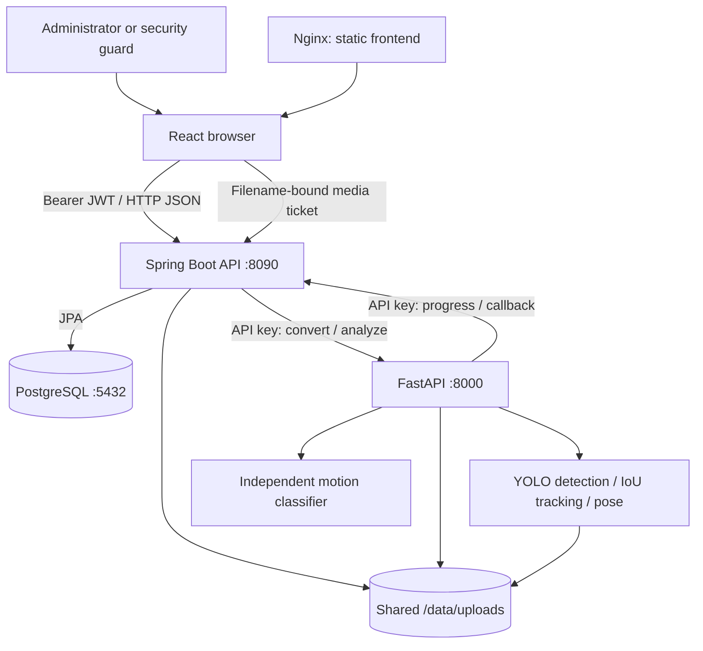

# Architecture

## Scope and service boundaries

Virtual Guard analyzes uploaded recordings and supports human incident review. React handles presentation; Spring Boot owns authentication, authorization, job state and persistence; FastAPI performs conversion and inference; PostgreSQL stores metadata. Video bytes remain on disk.



The supplied stack uses HTTP on localhost. This diagram does not imply configured HTTPS or a public production deployment. The browser contacts the backend host URL directly; Nginx serves static assets and SPA fallback, not an API reverse proxy.

## Frontend

[Router](../frontend/src/app/router.tsx) mounts the monitoring dashboard at `/`, the combined incident workspace at `/reports`, camera settings at `/settings`, and guard administration at `/guards`. `/analytics` redirects to `/reports?view=trends`; `/history` redirects to `/reports`. Authentication uses `/login` and `/change-password`.

React hooks load cameras, jobs and incidents through the [API client](../frontend/src/services/apiClient.ts). Job progress is polled, not delivered over WebSockets. The API client coordinates token refresh and stores access/refresh tokens in localStorage. Backend data drives map positions, review state and notifications; CSV export and trend aggregation happen in the browser. Incident trends describe flagged incidents, not all analyzed videos.

## Recording and analysis sequence

```mermaid
sequenceDiagram
    actor User
    participant UI as React
    participant API as Spring Boot
    participant DB as PostgreSQL
    participant AI as FastAPI
    participant Disk as Shared files
    User->>UI: Select monitored camera and recording
    UI->>API: POST /api/jobs (multipart)
    API->>Disk: Store original recording
    API->>AI: POST /convert (API key, absolute path)
    AI->>Disk: Write browser-compatible MP4
    AI-->>API: Converted path (or conversion error)
    API->>DB: Save QUEUED job
    API-->>UI: Job details
    User->>UI: Start analysis
    UI->>API: POST /api/jobs/{id}/start
    API->>DB: Lock, claim job and assign attempt UUID
    API->>AI: POST /analyze (job, attempt, shared path)
    AI-->>API: Accepted
    Note over AI: Background task waits for analysis slot; heartbeat runs
    AI->>Disk: Decode recording
    Note over AI: Sample frames: YOLO, IoU tracks, eligible human poses
    AI->>Disk: Second pass writes annotated video
    Note over AI: Independently extract motion features and classify video
    Note over AI: Optional experimental review segments for flagged clips
    AI->>API: Progress and completion callback with attempt UUID
    API->>DB: Save result; create incident for shoplifting prediction
    UI->>API: Poll jobs and incidents
    API-->>UI: Status, evidence and review information
    UI->>API: Request media ticket, then ranged playback
    User->>UI: Save note / confirm / dismiss / escalate
    UI->>API: Persist human review
    API->>DB: Store note and review state
```

[JobService](../backend/src/main/java/com/virtualguard/backend/service/JobService.java) orchestrates dispatch. Upload conversion uses H.264/AAC MP4 and fast-start metadata; if conversion fails, the backend can retain the original path. Uploading does not automatically start analysis. Multipart upload limits are 500 MB in the backend configuration.

[JobLifecycle](../backend/src/main/java/com/virtualguard/backend/service/JobLifecycle.java) serializes state changes. Jobs transition from `QUEUED` to `PROCESSING` and then `COMPLETED` or `FAILED`. Attempt IDs reject stale callbacks, duplicate completion does not create duplicate incidents, and failed dispatch remains persisted. Heartbeat/processing expiry marks abandoned work failed; a user can retry. There is no durable external worker queue or automatic replay after process loss.

[FastAPI routes](../ai-service/app/api/routes.py) use background tasks, an in-process semaphore (default one analysis), active-attempt deduplication and periodic heartbeats. Blocking inference runs in worker threads. Progress delivery has two attempts; final callback delivery has three attempts with backoff. These mechanisms do not provide exactly-once execution across restarts or replicas.

## Vision, annotation and behaviour

The [video pipeline](../ai-service/app/vision/video_pipeline.py) samples approximately five frames per second using a rounded frame stride. The analysis route explicitly passes detection confidence `0.25`; the detector/configuration defaults of `0.5` are not the effective threshold for this route. Intermediate frames reuse the last sampled overlays.

[SimpleTracker](../ai-service/app/vision/tracker.py) deduplicates overlapping same-class detections and greedily associates boxes with previous tracks using intersection over union. Defaults are match IoU 0.3, duplicate IoU 0.7 and maximum age 30 updates. IDs are local to one analysis; there is no appearance embedding, Kalman filter, ByteTrack or cross-camera identity model.

[Pose processing](../ai-service/app/vision/pose.py) loads `yolov8n-pose.pt` when enabled. On sampled frames with detected `person`/`people`, it associates poses to tracked human boxes using IoU and draws confident keypoints. Pose is an overlay and evidence aid, not an input to the behaviour classifier. Model/predictor caching is protected by locks; each video receives a new tracker.

The annotator decodes the recording again, draws boxes, IDs and pose overlays, encodes the result and preserves optional source audio. Evidence compaction bounds callback payloads. Counts can include repeated detections across frames and must not be interpreted as unique people or products. Per-frame detection storage and additional video passes increase memory and processing cost with video length.

[BehaviourAnalyzer](../ai-service/app/models/behaviour.py) independently samples every tenth frame, computes grayscale absolute differences and summarizes the mean motion signal into 14 features. A scaler and Random Forest classify the entire recording. The suspicion score is a separate heuristic. Experimental overlapping-window review suggestions are attempted for flagged clips; failure leaves full footage available. See [Model evaluation](MODEL_EVALUATION.md) for formulas, metrics and provenance.

## Persistence and operational features

The principal relationships are `User` to optional linked `Guard`, `Camera` to `ProcessingJob`, and `ProcessingJob` to `Incident`. PostgreSQL stores user/account state, camera positions, job attempts/progress/results and incident review metadata. Structured evidence, review segments and notes use JSONB fields. Media files are referenced by path rather than stored as database blobs.

Camera management includes creation, labels, stream-URL metadata, monitoring enablement and map coordinates. A stored stream URL does not start live ingestion. Unmonitored cameras cannot start new analysis. Incident management includes listing/filtering, evidence playback, notes and confirmed/dismissed/escalated review outcomes. Normal predictions remain completed jobs without incidents. Notification counts are derived from incident state; there is no external email/SMS delivery service.

Hibernate `ddl-auto: update` manages the current schema. There is no standalone migration framework. Filesystem writes are not rolled back with database transactions; database and media backups must be coordinated.

## Authentication and authorization

[SecurityConfig](../backend/src/main/java/com/virtualguard/backend/security/SecurityConfig.java) applies backend role checks. Both roles may list cameras, upload/start jobs, read incidents and perform review. Guard endpoints and camera mutations require `ADMIN`; frontend route guards also hide administrative views from `SECURITY_GUARD`.

Passwords are BCrypt hashes. Access and refresh JWTs have configured lifetimes of one and seven days. Validation consults current user/guard status and account authentication version, allowing password and status changes to invalidate sessions. Refresh issues another session, but there is no persistent refresh-token replay registry. Logging out clears browser credentials; it is not a global server-side logout operation.

Internal routes use `X-API-Key`, enforced separately from bearer authentication. The same private service key must be configured on Java and Python. Public health responses are diagnostics, not proof of full inference correctness.

### Password recovery

An administrator calls `POST /api/guards/{id}/reset-password`. [PasswordService](../backend/src/main/java/com/virtualguard/backend/service/PasswordService.java) locks the linked security-guard account, hashes the configured temporary password, sets `mustChangePassword` and increments `authVersion`. It does not reset administrator accounts or reactivate suspended guards. The password is shared separately, never returned by the API.

The browser redirects restricted users to `/change-password`; the JWT filter also blocks ordinary APIs, and media validation denies restricted accounts. `POST /api/auth/change-password` checks the current password, confirmation, a minimum of 12 characters and a maximum of 72 UTF-8 bytes, and rejects reuse of the current or configured temporary password. Successful change clears the restriction, increments the version again and returns fresh credentials. Both roles can change their own passwords.

### Media authorization

[VideoController](../backend/src/main/java/com/virtualguard/backend/controller/VideoController.java) issues a ticket through authenticated `POST /api/video/{filename}/ticket`. Playback `GET /api/video/{filename}?ticket=...` validates the signed filename-bound ticket and current account state, then supports HTTP byte ranges. The GET route being permitted through the general security matcher does not make playback anonymous. Filename validation and storage resolution constrain traversal. Authorization is application-wide, not per tenant or per incident owner.

## Docker, ports and storage

| Service | Container port | Default host port | Connections |
|---|---:|---:|---|
| Frontend Nginx | 80 | 8080 | Browser API URL compiled at build time |
| Spring Boot | 8090 | 8090 | `postgres:5432`, `ai-service:8000` |
| FastAPI | 8000 | 8000 | Callback to `backend:8090` |
| PostgreSQL | 5432 | 5432 | Backend database |

[Compose](../docker-compose.yml) binds published ports to loopback, waits on health dependencies and uses a named PostgreSQL volume. Frontend and backend use multistage builds; AI uses Python 3.11 with CPU PyTorch. All runtime models are copied into the AI image. Rebuild that image after an intentional model change.

| Location | Purpose |
|---|---|
| `backend/uploads/` | Host originals, converted and annotated recordings; auto-created storage |
| `/data/uploads` | Same bind mount in backend and AI containers; absolute paths must agree |
| `postgres_data` | Compose-managed database volume |
| `ai-service/models/` | Runtime detector, pose, classifier and scaler artifacts |
| `ai-service/datasets/`, `ai-service/runs/` | Reproducibility data and saved evidence; not needed in runtime image |
| `.env` | Private local configuration, excluded from Git and packaging |

Windows-native absolute media paths are not automatically migrated into Docker. See [Setup](SETUP.md) before switching execution modes.

## Implemented, experimental and absent

Implemented: uploaded-video jobs, object/pose overlays, per-video tracking, independent classification, role enforcement, guard recovery and persisted human review.

Experimental: model quality, heuristic suspicion score and temporal review suggestions. None establishes criminal intent.

Absent: continuous CCTV/RTSP ingestion, ReID, concealment detection, Kafka, Kubernetes manifests, durable job broker, automatic enforcement, MFA, tenant isolation, configured public TLS, object storage and automatic retention. Deployment hardening and independent model validation remain necessary for broader use.
