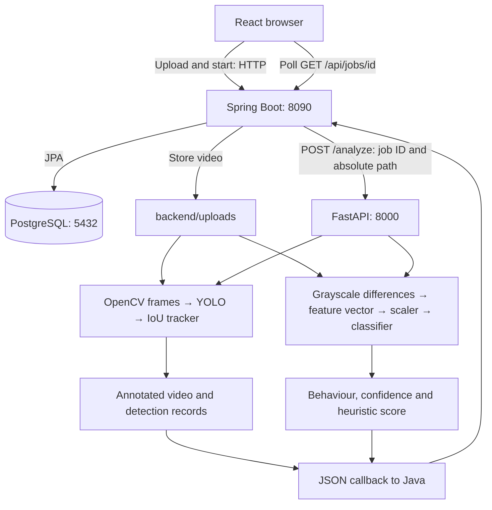
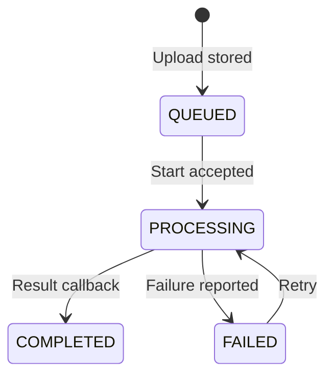
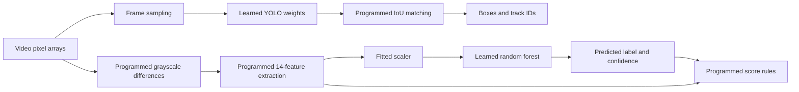
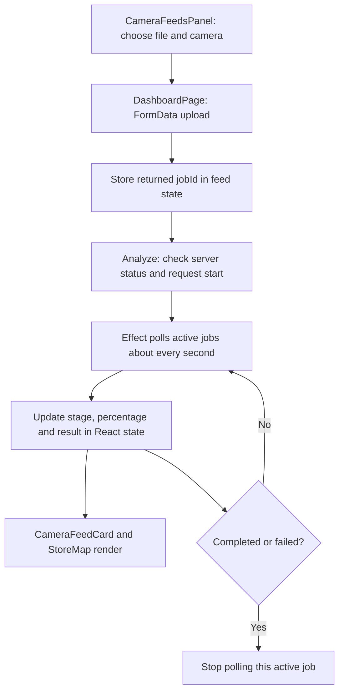
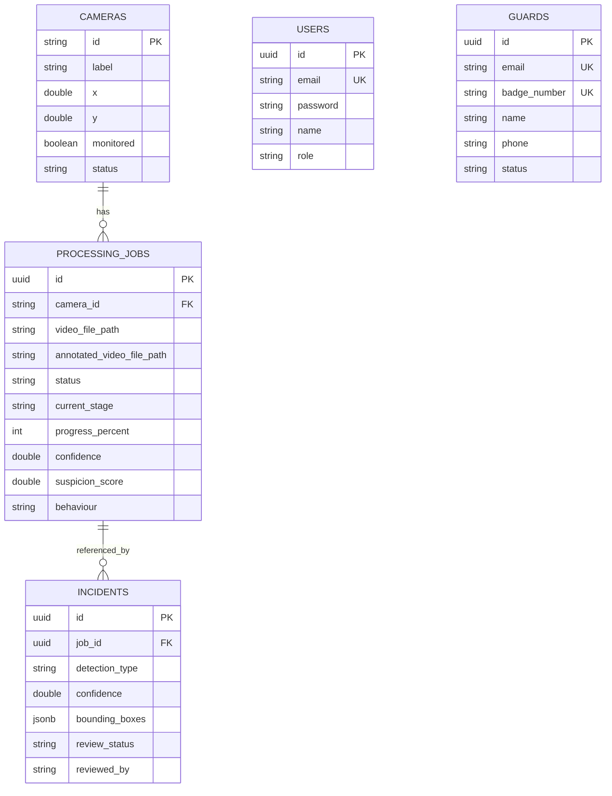
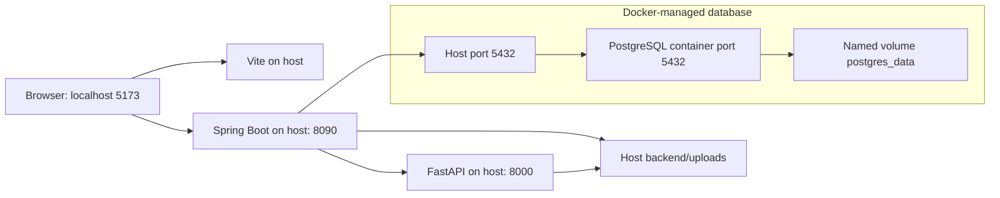
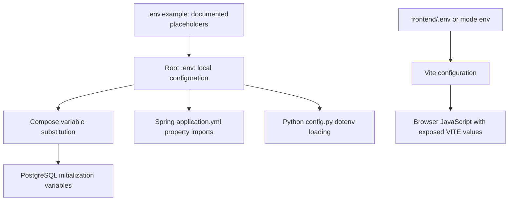
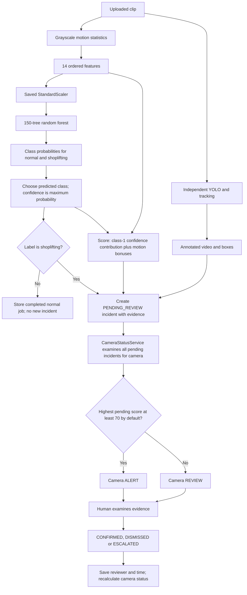

# Virtual Guard: backend and computational computer vision

This document explains the implementation for a computer science assessment: how a video becomes numerical data, how algorithms process it, and how the backend stores and exposes the result. It is based on the repository source inspected on 14 September 2026. Code excerpts are selected from the named functions; surrounding setup and error handling are sometimes omitted. Numerical examples are illustrative unless explicitly attributed to a saved experiment.

Reading guide: sections 1–5 cover the server architecture; 6–10 explain vision, learning and evaluation; 14 catalogs the algorithms; 15 maps the Spring Boot routes; 16 explains React; 17 maps database storage; 18–19 explain Docker and configuration; 20 traces the complete decision; and 21 provides technical presentation questions. Mermaid diagrams can be viewed in a Markdown renderer with Mermaid support, including GitHub.

## 1. Backend summary

Virtual Guard has two server applications. The Java Spring Boot application manages HTTP requests, authentication, video storage, processing jobs and PostgreSQL records. The Python FastAPI application performs the computational work: decoding video, applying a trained YOLO object detector, associating detections across frames, drawing annotations, extracting motion features and applying a saved behaviour classifier.

The input is an uploaded video associated with a camera ID. The outputs are an annotated video, a clip-level behaviour label, classifier confidence, a heuristic suspicion score and structured detection evidence. Java records these outputs; the React frontend requests the job's progress and displays them.

**The most important implementation distinction:** object detection and behaviour classification are separate computations. YOLO boxes and tracking IDs produce visual evidence. The behaviour classifier reads the video again and uses whole-frame grayscale intensity changes. It does **not** consume the YOLO boxes, person trajectories, bag interactions or product movements. Both outputs are combined in the callback, but there is no learned fusion between them.

This is an uploaded-clip processing system. The current pipeline does not implement continuous RTSP camera ingestion, facial recognition, pose estimation or a temporal neural network that reasons about person–product interactions.

## 2. Technology stack and its computational role

The rationale below explains why each technology fits the implementation; it is an engineering interpretation, not a claim about undocumented original design decisions. Versions are repository declarations, not independently verified installed versions.

| Technology | Repository evidence | What it does and why it fits |
|---|---|---|
| Java 17 target, Spring Boot 3.4.3 | [backend/pom.xml](../backend/pom.xml) | Provides controllers, dependency injection, validation, security filters and transactions. Java holds the application state and service contracts. |
| Spring Data JPA / Hibernate | [ProcessingJob.java](../backend/src/main/java/com/virtualguard/backend/entity/ProcessingJob.java) | Maps Java objects and relationships to database tables; repositories provide persistence operations without hand-writing each SQL statement. |
| PostgreSQL | [application.yml](../backend/src/main/resources/application.yml), [docker-compose.yml](../docker-compose.yml) | Stores relational job/camera/incident data and JSONB detection evidence. Compose declares PostgreSQL 16; an existing local database may run another version. |
| Python, FastAPI 0.115.6, Uvicorn 0.34.0 | [requirements.txt](../ai-service/requirements.txt), [main.py](../ai-service/app/main.py) | Python exposes the computer vision ecosystem through typed HTTP endpoints. Uvicorn runs the ASGI application; FastAPI validates requests and schedules background work. |
| Ultralytics 8.3.63, PyTorch 2.5.1 | [detector.py](../ai-service/app/vision/detector.py) | Loads trained YOLO weights and executes neural-network inference. The project calls the library rather than implementing the network layers or training gradients itself. |
| OpenCV 4.10.0.84 | [video_pipeline.py](../ai-service/app/vision/video_pipeline.py), [behaviour.py](../ai-service/app/models/behaviour.py) | Decodes frames into arrays, converts colour to grayscale, computes absolute differences and draws rectangles/text. |
| NumPy and pandas | [behaviour.py](../ai-service/app/models/behaviour.py) | Reduce image changes to statistics and assemble a numeric feature vector. NumPy handles array operations; pandas supplies skewness and kurtosis. |
| scikit-learn and joblib | [behaviour.py](../ai-service/app/models/behaviour.py), [train_behaviour_model.py](../ai-service/scripts/train_behaviour_model.py) | Apply a saved scaler and classifier. Joblib loads serialized artifacts so training need not run for each request. |
| FFmpeg via imageio-ffmpeg | [annotator.py](../ai-service/app/vision/annotator.py), [routes.py](../ai-service/app/api/routes.py) | Encodes H.264 video, AAC audio and browser-compatible MP4 output after OpenCV processing. |
| HTTPX / Spring RestClient | [routes.py](../ai-service/app/api/routes.py), [RestClientConfig.java](../backend/src/main/java/com/virtualguard/backend/config/RestClientConfig.java) | Carry JSON requests and callbacks between Python and Java, with timeouts and callback retries. |
| React, TypeScript and Vite | [frontend/package.json](../frontend/package.json) | Upload files and poll job state. Computer vision runs in Python, not in the browser. |

The two-language design keeps the persistence/API layer separate from numerical processing. Its cost is additional coordination: HTTP failures, shared-file access, matching API keys and consistent job transitions must all be handled.

## 3. How the components connect



These are two logical analysis branches, but `routes.py` executes the vision pipeline first and behaviour prediction second. The diagram does not imply they run simultaneously.

Java sends a **filesystem path**, not video bytes, to FastAPI. Both processes must be able to access that same path. This works when running locally on one machine. Deploying them to separate machines or containers would require shared storage with compatible paths or a different transfer mechanism.

| Connection | Contract | Source |
|---|---|---|
| Browser → Java | `POST /api/jobs`, multipart `cameraId` and `file`; returns HTTP 202 with job ID | [JobController.java](../backend/src/main/java/com/virtualguard/backend/controller/JobController.java) |
| Browser → Java | `POST /api/jobs/{id}/start`; returns HTTP 202 after dispatch succeeds | [JobController.java](../backend/src/main/java/com/virtualguard/backend/controller/JobController.java) |
| Java → Python | `POST /convert`, JSON `video_path`; attempts browser conversion during upload | [JobService.java](../backend/src/main/java/com/virtualguard/backend/service/JobService.java) |
| Java → Python | `POST /analyze`, JSON `job_id` and `video_path`, with `X-API-Key` | [routes.py](../ai-service/app/api/routes.py) |
| Python → Java | `POST /internal/jobs/{id}/progress`, JSON `stage` and `progress` | [InternalJobController.java](../backend/src/main/java/com/virtualguard/backend/controller/InternalJobController.java) |
| Python → Java | `POST /internal/jobs/{id}/callback`, result JSON | [AiCallbackRequest.java](../backend/src/main/java/com/virtualguard/backend/dto/AiCallbackRequest.java) |
| Browser → Java | `GET /api/jobs/{id}` for progress; `GET /api/video/{filename}?token=...` for playback | [DashboardPage.tsx](../frontend/src/features/dashboard/DashboardPage.tsx), [VideoController.java](../backend/src/main/java/com/virtualguard/backend/controller/VideoController.java) |

Python's `/analyze` currently returns HTTP **200** with `status: accepted`; that string should not be confused with an HTTP 202 response.

## 4. Java backend: from upload to a completed job

### 4.1 Controller, service, repository and entity

The request passes through a controller, which translates HTTP input into Java arguments. A service implements application operations. A repository accesses persistent entities. For analysis, the central files are:

| Folder/file | Responsibility |
|---|---|
| [controller/JobController.java](../backend/src/main/java/com/virtualguard/backend/controller/JobController.java) | Upload, list, inspect and start jobs. |
| [service/JobService.java](../backend/src/main/java/com/virtualguard/backend/service/JobService.java) | Store uploaded video, request conversion, dispatch analysis, update progress and accept results. |
| [repository/ProcessingJobRepository.java](../backend/src/main/java/com/virtualguard/backend/repository/ProcessingJobRepository.java) | Database access for processing jobs. |
| [entity/ProcessingJob.java](../backend/src/main/java/com/virtualguard/backend/entity/ProcessingJob.java) | UUID, camera foreign key, filenames, status, stage, percentage, prediction fields and timestamps. |
| [service/IncidentService.java](../backend/src/main/java/com/virtualguard/backend/service/IncidentService.java) | Converts a `shoplifting` classification into a pending review record and stores evidence. |
| [entity/Incident.java](../backend/src/main/java/com/virtualguard/backend/entity/Incident.java) | Job relationship, confidence, JSONB evidence and review state. |

`ProcessingJob` has a many-to-one camera relationship; `Incident` has a many-to-one job relationship. These annotations express database relationships. Videos remain on disk; PostgreSQL stores filenames, structured state and incident evidence rather than raw video frames.

### 4.2 File storage and conversion

[FileStorageService.java](../backend/src/main/java/com/virtualguard/backend/storage/FileStorageService.java), `storeFile()`, rejects empty uploads and unsupported extensions, removes path components, sanitizes the filename, checks its length and resolves it inside the storage directory. It chooses another name when a file already exists, copies to a temporary file and then moves it to the destination. An atomic move is attempted, with a normal move fallback.

```java
Path filePath = storageRoot.resolve(filename).normalize();
if (!filePath.startsWith(storageRoot)) {
    throw new IllegalArgumentException("Invalid filename");
}
```

This is path containment checking: a supplied filename must not address a location outside the upload directory. Extension validation is not a complete verification of the file's internal video format; decoding happens later.

`JobService.submitJob()` calls Python `/convert`. FFmpeg writes H.264/yuv420p video and AAC audio with `+faststart`, first using a temporary output filename. If conversion is unavailable, Java logs the failure and retains the original upload. Conversion occurs during submission, so upload completion can include transcoding time.

### 4.3 Job state and dispatch

The intended lifecycle is:



The start guard in `JobService.startJob()` is:

```java
if (job.getStatus() != JobStatus.QUEUED && job.getStatus() != JobStatus.FAILED) {
    throw new IllegalStateException("Only queued or failed jobs can be started");
}
```

[GlobalExceptionHandler.java](../backend/src/main/java/com/virtualguard/backend/exception/GlobalExceptionHandler.java) maps this exception to HTTP 409. It means the requested operation conflicts with stored state. It is not a YOLO inference error.

The Java-to-Python dispatch uses:

```java
.uri(fastApiBaseUrl + "/analyze")
.contentType(MediaType.APPLICATION_JSON)
.header("X-API-Key", apiKey)
.body(new AiJobRequest(
        job.getId().toString(),
        videoPath))
```

The UUID correlates later callbacks with the original job. `RestClientConfig` sets configurable connection/read timeouts, defaulting to 5 and 600 seconds.

### 4.4 Receiving results

`InternalJobController.completeJob()` validates `AiCallbackRequest`, then calls `JobService.completeJob()`. The DTO constrains confidence to 0–1, suspicion score to 0–100, labels to `normal|shoplifting`, and detection evidence to at most 500 records. The service marks the job complete, saves the result fields and extracts the annotated video's basename.

`IncidentService.createFromAiResult()` creates an incident only for the `shoplifting` label. It checks whether an incident already exists for the job before creating another. This is an application-level duplicate check; the inspected `Incident` entity does not declare a unique job constraint, so it should not be described as a complete guarantee against concurrent duplicate callbacks.

The incident threshold is **not** score ≥70. Incident creation itself checks the behaviour label. The dashboard uses 70 for high-alert presentation, and `CameraStatusService` uses a configurable threshold, default 70, to derive the persisted camera status from pending incidents. Section 20 distinguishes these decisions.

### 4.5 Authentication and playback

[SecurityConfig.java](../backend/src/main/java/com/virtualguard/backend/security/SecurityConfig.java), [JwtAuthenticationFilter.java](../backend/src/main/java/com/virtualguard/backend/security/JwtAuthenticationFilter.java) and [JwtTokenProvider.java](../backend/src/main/java/com/virtualguard/backend/security/JwtTokenProvider.java) handle token-based access. BCrypt hashes passwords. [InternalApiKeyFilter.java](../backend/src/main/java/com/virtualguard/backend/security/InternalApiKeyFilter.java) separately protects internal callbacks.

Video requests are permitted through the general security chain but checked inside `VideoController` using the query-string access token. Playback supports a requested byte range and returns HTTP 206 with `Content-Range`. This lets a browser seek within a video without downloading it all first. The implementation handles the first requested range and bounds the input stream to that range.

## 5. Python execution and concurrency

The entry point is [app/main.py](../ai-service/app/main.py). It registers the routes from [app/api/routes.py](../ai-service/app/api/routes.py). The behaviour model is loaded once at route-module initialization; the detector is instantiated separately inside each video pipeline invocation.

The request schema forbids extra fields and requires a UUID:

```python
class JobRequest(BaseModel):
    model_config = ConfigDict(extra="forbid")
    job_id: UUID
    video_path: str
```

The endpoint checks the API key and file existence, then schedules work:

```python
background_tasks.add_task(process_video, job)
return {"status": "accepted", "job_id": job.job_id}
```

`process_video()` acquires an `asyncio.Semaphore`, with `MAX_CONCURRENT_ANALYSES` defaulting to 1. This limits simultaneous analyses within one Python process. It is not a durable queue, and multiple Uvicorn worker processes would each have their own semaphore.

The heavy synchronous operations run through `asyncio.to_thread(...)`. This prevents the request event loop from directly executing the video-processing function. It does not remove CPU/GPU computation costs or guarantee arbitrary CPU parallelism.

Progress values such as 10, 20, 80 and 100 are stage markers. The pipeline does not calculate these percentages from measured remaining processing time or send per-frame progress.

## 6. Computer vision branch: frames, detections and tracks

### 6.1 Video as numerical data

A decoded colour frame is an array of shape approximately `(height, width, 3)`. OpenCV provides BGR channel ordering. A video is a sequence of such arrays plus frame rate and other metadata. Computer vision operates on these numerical arrays.

The orchestration function is `process_video_pipeline()` in [app/vision/video_pipeline.py](../ai-service/app/vision/video_pipeline.py). It opens the video with `cv2.VideoCapture`, reads the source FPS and calculates a sampling stride:

```python
source_fps = cap.get(cv2.CAP_PROP_FPS) or 25.0
frame_stride = max(1, round(source_fps / max(1.0, analysis_fps)))
```

For a 30 FPS clip and requested 5 analysis FPS, the stride is 6: YOLO runs on frames 0, 6, 12, and so on. A 60-second clip with 1,800 frames therefore needs about 300 detector calls. The achieved analysis rate is `source_fps / frame_stride`; rounding means it need not exactly equal the requested rate.

Every frame is still decoded by the loop. Sampling reduces detector work, not all decoding work.

### 6.2 YOLO inference

[app/vision/detector.py](../ai-service/app/vision/detector.py), `YOLODetector.load_model()`, loads the configured `.pt` weights. [app/core/config.py](../ai-service/app/core/config.py) resolves `VISION_MODEL=v1`, `v2`, `base` or a named model; a custom path can override the selection. `.env.example` selects v2, while the code's fallback selection is v1. The actual runtime choice depends on environment configuration.

The custom dataset's labels are `bag`, `busket`, `people`, `product`. `busket` is the spelling stored in the dataset schema. Detector output names come from the loaded model; selecting a different model can change the vocabulary.

```python
results = self.model(frame, verbose=False, conf=threshold)
for result in results:
    for box in result.boxes:
        xyxy = box.xyxy[0].tolist()
        conf = float(box.conf[0])
        cls_id = int(box.cls[0])
        class_name = result.names.get(cls_id, str(cls_id))
```

The library executes learned feature extraction and bounding-box/class prediction, and returns postprocessed detections. The project converts library tensors into ordinary Python numbers and dictionaries. Each dictionary contains a class ID, name, confidence and `[x1, y1, x2, y2]` pixel coordinates.

YOLO answers “which object classes appear, and where?” Its confidence is an object-detection score, not the probability that the whole clip contains a particular behaviour.

The live `/analyze` path explicitly passes `confidence_threshold=0.25`. Although configuration declares a default confidence of 0.5, that is overridden here. Similarly, `IOU_THRESHOLD` is declared in config but is not passed as an `iou` argument in `detect_frame()`; do not describe it as the effective runtime suppression setting.

### 6.3 Association using intersection over union

[app/vision/tracker.py](../ai-service/app/vision/tracker.py), `SimpleTracker`, gives detections short-lived IDs across analyzed frames. It uses bounding-box overlap:

```text
IoU(A, B) = intersection_area / (area(A) + area(B) - intersection_area)
```

For example, two 100×100 boxes overlapping over 80×100 pixels have IoU `8000 / 12000 ≈ 0.667`. They exceed the default matching threshold of 0.3.

`update()` first removes tracks older than `max_age=30` tracker updates. It deduplicates overlapping detections of the same class using threshold 0.7, preferring higher confidence. It then greedily selects the unmatched active track of the same class with greatest IoU. A detection without a sufficient match gets a new integer ID.

```python
if best_track_id is None or best_iou < self.match_iou_threshold:
    best_track_id = self._next_id
    self._next_id += 1
```

The `matched_track_ids` set prevents one track from being assigned to multiple detections in the same update. `_active` is a dictionary keyed by track ID for retained state.

This tracker does not compute appearance embeddings, velocity estimates, Kalman-filter predictions or a global optimal assignment. Fast motion, crossings and occlusion can change IDs. Thirty updates is approximately six seconds at five analyzed frames per second, rather than thirty original video frames.

### 6.4 Reusing boxes between analyzed frames

The pipeline performs:

```python
if frame_index % frame_stride == 0:
    detections = detector.detect_frame(frame, conf_threshold=confidence_threshold)
    last_tracked = tracker.update(detections)
    for detection in last_tracked:
        detection["label"] = detection.get("class_name", "OBJECT")
    analyzed_frame_count += 1
detections_by_frame[frame_index] = [dict(detection) for detection in last_tracked]
```

Intermediate frames reuse the last boxes. This is a hold-last-value approximation, not interpolation or fresh inference. A moving object may briefly move outside its displayed box before the next detection update.

### 6.5 Annotation and evidence compaction

[app/vision/annotator.py](../ai-service/app/vision/annotator.py) reads the video in another pass, draws a rectangle, uppercase label, confidence and tracking ID, then writes a temporary MP4. FFmpeg re-encodes it to H.264/yuv420p and copies available source audio through AAC encoding. The output is an annotated evidence video at the source dimensions and FPS.

[app/vision/evidence.py](../ai-service/app/vision/evidence.py), `compact_detections()`, flattens frame dictionaries and selects at most 500 records distributed across the flattened record sequence:

```python
records = [
    records[round(index * (total - 1) / (max_records - 1))]
    for index in range(max_records)
]
```

This is evenly spaced **record-index** sampling, not guaranteed equal-time sampling: frames with many detections contribute more records. Summary counts include all records, including copied boxes on skipped frames. Consequently, `totalDetections` is not a count of unique people or objects, and it is not a count of independent neural-network detections.

## 7. Behaviour branch: image differences to a feature vector

The implementation is [app/models/behaviour.py](../ai-service/app/models/behaviour.py), `BehaviourAnalyzer.extract_features_from_video()`.

### 7.1 Independent sampling and motion measurement

This branch samples frames `0, 10, 20, ...`, independently of `VISION_ANALYSIS_FPS`. At 30 FPS it samples approximately three frames per second. The FPS value is read but does not control this stride.

```python
for i in range(0, frame_count, 10):
    cap.set(cv2.CAP_PROP_POS_FRAMES, i)
    ret, frame = cap.read()
    if not ret:
        break
    processed += 1
    gray = cv2.cvtColor(frame, cv2.COLOR_BGR2GRAY)
    if prev_frame is not None:
        diff = cv2.absdiff(gray, prev_frame)
        motion = np.mean(diff)
        motions.append(motion)
    prev_frame = gray
```

Let `G_t(x,y)` be grayscale intensity at pixel `(x,y)` in sampled frame `t`. The computation is:

```text
D_t(x,y) = |G_t(x,y) - G_(t-1)(x,y)|
m_t = sum of D_t over all pixels / (width × height)
```

`cv2.absdiff` computes absolute changes without unsigned-byte subtraction wraparound. `np.mean` reduces the difference image to one scalar. If 100 pixels change by intensity 50 in a 10,000-pixel image and all others remain unchanged, mean motion is `100 × 50 / 10000 = 0.5`.

This measures intensity change across the entire image. It is sensitive to object movement, lighting changes and camera motion. It is not optical flow, physical speed, a count of moving people or a localized measurement of a person's hands.

### 7.2 Fourteen features

Let the motion sequence contain `n` values, with mean `μ`. Let `P` be sampled frames successfully read and `F` the original frame count. The default v2 schema is:

| Feature | Actual computation and interpretation |
|---|---|
| `avg_motion` | Mean `μ`: average image change. |
| `max_motion` | Largest motion value: strongest change. |
| `min_motion` | Smallest motion value. |
| `motion_std` | Population standard deviation from NumPy: variation around the mean. |
| `motion_median` | Middle value after ordering motion magnitudes. |
| `motion_variance` | Population variance, `sum((m-μ)^2)/n`. |
| `motion_range` | `max_motion - min_motion`. |
| `motion_skew` | pandas skewness when `n > 2`, otherwise zero. Describes asymmetry. |
| `motion_kurtosis` | pandas kurtosis when `n > 3`, otherwise zero. Describes distribution tail/shape. |
| `activity_score` | `μ × P/F`, or zero if `F=0`. This weights by sampling fraction, not clip duration. |
| `high_motion_ratio` | Fraction of motion values strictly above 20. |
| `low_motion_ratio` | Fraction strictly below 5. |
| `motion_peaks` | Number of interior values greater than 1.5 times both neighbours. |
| `motion_trend` | 1 if the second-half mean exceeds the first-half mean, otherwise −1; zero only when fewer than two motion values exist. |

An equal first/second-half mean returns −1, not zero. These exact definitions matter when describing or reproducing the algorithm.

Illustration: motion values `[2, 4, 25, 3, 1]` have mean 7, maximum 25, minimum 1, range 24, median 3, high-motion ratio 0.2, low-motion ratio 0.8 and one significant peak. Their first-half mean is 3 and second-half mean is about 9.67, so trend is 1. Their population variance is 82 and standard deviation about 9.06.

The result is a two-dimensional array shaped `(1, 14)` for the expected v2 artifacts: one video, fourteen features. When available, the loaded scaler's `feature_names_in_` determines feature order. Consistent order is essential: the model cannot infer that a number in the wrong column was meant to represent another feature.

`validate_feature_vector()` checks width and finite values, and tests use it. The current `predict()` method does not explicitly call that helper, so its presence should not be described as guaranteed runtime validation before scaling.

### 7.3 Scaling and classification

`BehaviourAnalyzer` defaults to `models/behaviour_model_v2.pkl` and `models/scaler_v2.pkl`. These are loaded using joblib. The prediction path is:

```python
features_scaled = self.scaler.transform(features)
prediction = self.model.predict(features_scaled)[0]
confidence = np.max(self.model.predict_proba(features_scaled))
behaviour = 'shoplifting' if prediction == 1 else 'normal'
```

A fitted standard scaler transforms each feature using training statistics, conventionally `z_j = (x_j - μ_j) / σ_j`. It must be reused during inference; fitting a new scaler to each uploaded video would change the model's input meaning.

The local v2 model and scaler were loaded read-only with joblib for this review. Their inspected metadata is:

| Saved artifact property | Verified value |
|---|---|
| Estimator | `RandomForestClassifier` |
| Number of trees | 150 |
| Maximum tree depth | 12 |
| Minimum samples to split a node | 5 |
| Split criterion | `gini` |
| Candidate features per split | `sqrt` |
| Bootstrap sampling | Enabled |
| Random seed parameter | 42 |
| Input feature count | 14 |
| Classes | `[0, 1]` |
| Scaler | `StandardScaler` |
| Scaler feature order | Matches the fourteen-feature table above |

The repository's explicit training script, [scripts/train_behaviour_model.py](../ai-service/scripts/train_behaviour_model.py), instead trains a `RandomForestClassifier(n_estimators=100, max_depth=10, random_state=42)` on four features and writes **unversioned** `behaviour_model.pkl` and `scaler.pkl`. It does not reproduce the default fourteen-feature v2 pair. Inspecting the saved v2 parameters confirms the model type, but does not recover its complete training data history.

A random forest combines decision trees that repeatedly test feature thresholds. For example, an illustrative node could test whether standardized `max_motion` exceeds a learned value; each answer selects a child node until a leaf is reached. This example is not an extracted rule from the saved forest.

During training, Gini impurity measures how mixed a node's labels are: `G = 1 - sum(p_k²)`. A node with half normal and half shoplifting examples has impurity 0.5; a node containing only one class has impurity 0. Candidate splits are compared by their reduction in weighted child impurity. Bootstrap sampling and randomized candidate features help make the trees differ.

At inference, the forest averages tree class-probability outputs and selects the largest class probability. The v2 forest therefore performs up to roughly `150 × 12` split decisions per video, plus probability aggregation, given its saved depth limit. This is much smaller input processing than repeated neural inference over video frames. It learns relationships among the numeric feature columns rather than consuming raw video pixels. Tree models generally do not need standard scaling in the same way distance-based models do, but the saved model/scaler contract must still be followed.

The returned confidence is the maximum predicted class probability. For a normal prediction it is confidence in the normal class, not the probability of shoplifting. It should not be described as a calibrated guarantee of correctness.

### 7.4 Heuristic suspicion score

`calculate_suspicion_score()` applies manually written rules after classification:

```text
score = 50 × confidence, if predicted label = 1; otherwise 0
add 20 if avg_motion > 5
add 15 if max_motion > 15
add 10 if motion_std > 3
return min(100, score)
```

For a class-1 prediction with confidence 0.90 and all three motion thresholds exceeded, the score is `45 + 20 + 15 + 10 = 90`. With confidence at most 1, the formula's achievable maximum is **95**, despite the cap of 100. A normal prediction can still score up to 45 from motion rules.

This score is a heuristic combination of a learned output and fixed thresholds. It is not a second learned probability. Detection confidence, classifier confidence and suspicion score are three distinct quantities.

## 8. Dataset computation and training

### 8.1 The currently open class-distribution script

[scripts/analyze_mall_class_distribution.py](../ai-service/scripts/analyze_mall_class_distribution.py) is an offline dataset-analysis tool, not part of an uploaded video's runtime inference. `analyze_dataset()` processes the `train`, `valid` and `test` splits under `ai-service/datasets/mall_surveillance/`.

`analyze_split()` enumerates images and reads each corresponding YOLO label text file. A row has the representation:

```text
class_id x_center y_center width height
```

Coordinates and dimensions are normalized to image dimensions. For an image of width `W` and height `H`, a normalized box converts to pixels through `x1=(x_center-width/2)×W`, `x2=(x_center+width/2)×W`, with the equivalent formula for y and height.

The script counts object instances per class and distinct images containing each class. A set of `(image_name, class_id)` pairs ensures that ten people in one image contribute ten instances but only one image to that class's image count.

```python
area = width * height
aspect_ratio = width / height if height > 0 else 0
```

These are normalized box area and normalized width/height ratio. On a non-square original image, physical pixel aspect ratio is `(width × W)/(height × H)`, so the stored ratio is not necessarily the pixel aspect ratio.

Class frequency helps identify imbalance. Small normalized areas indicate limited object detail after resizing, providing a reason to experiment with higher detector resolution. The script also reports missing labels, malformed rows, empty labels and coordinate problems. It reads the dataset without changing it, but **writes a report** to `runs/data_analysis/mall_detector_v2/dataset_analysis.json`.

Its checks are diagnostic rather than exhaustive: box-edge violations are recorded but those boxes are still counted as valid instances; it does not reject all unknown class IDs. [app/vision/dataset_validator.py](../ai-service/app/vision/dataset_validator.py) separately checks exact field count, class range, finite normalized coordinates and positive dimensions. That validator does not perform the same explicit box-edge test. The two tools should be understood from their actual checks.

### 8.2 Detector training versus inference

Training changes network weights using labelled examples; inference loads fixed weights to predict unseen inputs. Uploaded analysis calls do not retrain YOLO.

[scripts/train_mall_detector_v2.py](../ai-service/scripts/train_mall_detector_v2.py) documents a YOLOv8n-based experiment with image size 640, up to 100 epochs, batch size 16, patience 20, SGD and augmentations including mosaic, mixup, flips, translations, scale and colour variation. Higher image resolution can preserve more detail for small objects, at greater computation and memory cost. More epochs permit additional optimization, while early stopping limits training without validation improvement.

**The current executable script resumes an existing run**, despite introductory comments describing the original base model:

```python
model = YOLO(str(resume_checkpoint))
```

It requires `runs/detect/virtual_guard_mall_detector_v2/weights/last.pt` and passes `resume=True` to `model.train(...)`. It verifies protected artifact SHA-256 hashes against `PHASE5_BASELINE_MANIFEST.json`, then copies the selected `best.pt` to `models/virtual_guard_mall_detector_v2.pt`. It is not presently a fresh-training command for an empty checkout. Resumed checkpoint settings and saved run arguments must be checked before claiming all requested options were applied.

The saved [args.yaml](../ai-service/runs/detect/virtual_guard_mall_detector_v2/args.yaml) records CPU execution, image size 640 and the resumed checkpoint. It contains historical absolute paths from before the folder move. Do not assume those paths still resolve on this machine.

### 8.3 Behaviour training and provenance

[scripts/extract_improved_features.py](../ai-service/scripts/extract_improved_features.py) builds the fourteen motion statistics for labelled video files and writes `datasets/features/video_features_improved.csv`. It obtains the label from each video's parent folder. Its unused `person_counts` variable does not implement person-count features.

[training/evaluate_behaviour.py](../ai-service/training/evaluate_behaviour.py) loads the v2 model/scaler, checks feature schema, and constructs stratified video-name splits of approximately 70% training, 15% validation and 15% test. Splitting by video name helps keep rows for the same named video together.

However, this script evaluates an **already trained artifact**. Creating a new split at evaluation time does not prove those test videos were excluded from the artifact's original training. Independent generalization claims need the original training split/provenance and checks for related clips from the same source scene. The four-feature training script also uses an 80/20 split and cannot be treated as the v2 training recipe.

## 9. Evaluation evidence and what it establishes

The saved [v1/v2 comparison report](../ai-service/runs/evaluation/v1_vs_v2/comparison_report.json), timestamped 4 September 2026, reports the following detector test-set results. These are historical artifact values, not a fresh evaluation performed for this document.

| Metric | V1 | V2 |
|---|---:|---:|
| Mean precision | 0.7276 | 0.6003 |
| Mean recall | 0.2772 | 0.4643 |
| mAP@0.50 | 0.2472 | 0.4755 |
| mAP@0.50:0.95 | 0.0890 | 0.2235 |
| Bag AP@0.50 | 0.0420 | 0.2287 |
| `busket` AP@0.50 | 0.4024 | 0.6735 |
| People AP@0.50 | 0.5171 | 0.8796 |
| Product AP@0.50 | 0.0274 | 0.1202 |

Precision measures how many predicted positives are correct; recall measures how many actual positives are found. For detection, correctness also requires a suitable class and box match. AP summarizes a precision–recall curve; mAP averages AP across classes. The `0.50:0.95` metric evaluates progressively stricter overlap requirements.

V2 improves recall and AP in this saved experiment but reduces mean precision. Product detection remains weak. The report explicitly records **`decision: REJECTED`**, with all listed acceptance levels unmet. This should be presented alongside improvements, rather than reporting only favourable numbers. Detector AP is not behaviour-classifier accuracy and does not establish end-to-end incident accuracy.

[scripts/compare_mall_detectors_v1_v2.py](../ai-service/scripts/compare_mall_detectors_v1_v2.py) calls `model.val(split="test", imgsz=640, ...)` for both models. [scripts/evaluate_mall_detector.py](../ai-service/scripts/evaluate_mall_detector.py) currently selects v1 explicitly despite its general filename.

### Behaviour evaluation run for this guide

On 14 September 2026, [training/evaluate_behaviour.py](../ai-service/training/evaluate_behaviour.py) was run successfully using the existing local v2 artifacts and stored feature dataset. [Captured output and limitations](behaviour-evaluation-2026-09-14.md) are preserved alongside this guide. This ran classification on stored feature rows; it did not decode videos again, retrain the model or rerun YOLO.

| Observation | Result |
|---|---:|
| Dataset videos | 182: 90 normal, 92 shoplifting |
| Script-created train / validation / test split | 127 / 27 / 28 videos |
| Test support | 14 normal, 14 shoplifting |
| Accuracy | 82.14% |
| Shoplifting precision | 80.00% |
| Shoplifting recall | 85.71% |
| Shoplifting F1 | 82.76% |

The confusion matrix is:

| Ground truth | Predicted normal | Predicted shoplifting |
|---|---:|---:|
| Normal | 11 true negatives | 3 false positives |
| Shoplifting | 2 false negatives | 12 true positives |

Thus 23 of 28 predictions were correct: `23/28 ≈ 82.14%`. Of 15 predicted positives, 12 were correct, giving precision `12/15 = 80%`. Of 14 actual positives, 12 were found, giving recall `12/14 ≈ 85.71%`.

These results support a **local baseline observation**, not a verified independent holdout claim. As explained in section 8.3, the script creates its split after loading an existing model and does not establish that these videos were excluded from original training. The small test sample, stored-feature evaluation and provenance limitation should accompany the number whenever presented. Complete-pipeline accuracy and latency require separate evaluation.

## 10. Computational complexity and resource costs

Let `F` be original frames, `P=W×H` pixels per original frame, `s` detector stride, `D` detections per analyzed frame, `A` active tracks and `C_Y` the cost of one detector call at its inference resolution. These are algorithmic estimates from the loops, not benchmark measurements.

| Operation | Approximate cost | Consequence |
|---|---|---|
| Decode full vision pass | Proportional to decoded video size, roughly `O(FP)` array work | Skipping YOLO calls does not skip this pass. |
| Detector calls | `O(ceil(F/s) × C_Y)` | Larger stride reduces neural inference frequency. |
| Tracker deduplication | `O(D²)` per analyzed frame | Each detection can be compared with earlier retained detections. |
| Greedy track matching | `O(D×A)` per analyzed frame | More objects and stale tracks increase comparisons. |
| Annotation pass | Roughly `O(FP)` plus drawing/encoding | Requires a second video pass and an FFmpeg encode. |
| Motion differences | Roughly `O(ceil(F/10) × P)` image arithmetic | Codec seeking may decode extra frames; this is not a full timing model. |
| Motion statistics | Most reductions `O(n)`; median may have additional implementation-dependent cost | Fourteen features greatly compress the clip but lose spatial detail. |
| Detection storage | Approximately `O(FD)` records | The pipeline retains boxes for every original frame in memory. |

The 500-record callback cap bounds transmitted evidence, **not** peak pipeline memory: `compact_detections()` first materializes all records. A long crowded clip can therefore use substantial memory even with sparse detector inference.

For a 60-second, 30 FPS clip: about 1,800 frames are decoded in the first vision pass, 300 detector calls occur at five analysis FPS, another 1,800 frames are processed for annotation, and 180 frames are sought/read for behaviour features, producing approximately 179 motion values. FFmpeg conversion and final encoding add more work. These counts are illustrative, not a claim that the clip processes in real time.

A practical benchmark should record clip duration, dimensions, frame rate, CPU/GPU, detector choice, stride, detector initialization time, per-stage elapsed time and peak memory. Report end-to-end time separately from per-frame inference time.

## 11. Reliability and scientific limitations visible in the code

These limitations follow directly from the implementation and are useful topics for an assessment discussion:

1. **No object–behaviour feature connection.** The detection branch can show a bag and a person, but the classifier does not use their relationship. Improving YOLO AP does not automatically improve the current behaviour model.
2. **Global motion confounds.** Camera shake, lighting and unrelated movement can affect all fourteen features. Fixed frame-stride sampling also represents different time intervals at different video frame rates.
3. **Feature compression.** The classifier sees a summary of the whole clip, so it does not localize the exact time or person responsible for its label. Most temporal ordering is discarded.
4. **In-memory background work.** A Python process restart loses scheduled work. There is no persistent task broker or stale-processing recovery shown in the current route code.
5. **Transaction/HTTP boundary.** `JobService.startJob()` is transactional and calls another service before returning. Its catch block saves `FAILED` and rethrows a runtime exception; ordinary Spring transaction rollback can roll back that save. The code should not be described as guaranteeing persisted failure state on every dispatch error.
6. **Concurrency boundary.** A state check alone is not an atomic claim under competing requests. There is no explicit version column or locking in the inspected job entity/start method. Browser duplicate-click protection does not replace server-side concurrency control.
7. **Callback delivery.** Progress sends retry twice with a short delay and then log/return. Result callbacks retry three times with 1- and 2-second backoff. Exhausted retries can leave database state different from completed computation on disk.
8. **Artifact provenance.** Saved detector metrics predate this review; the complete v2 behaviour training recipe is not supplied by the older four-feature script. Reproducibility requires matching data, splits, artifact hashes and dependency versions.

Potential extensions, not current features, include connecting track-level object interactions to a new classifier, time-based sampling, camera-motion compensation, streaming annotation/evidence to reduce memory, transactional job claiming and a durable task queue. Each would need its own evaluation rather than an assumption of improvement.

## 12. Code reading and demonstration guide

For a lecturer walkthrough, follow this order:

1. Open [JobController.java](../backend/src/main/java/com/virtualguard/backend/controller/JobController.java) and [JobService.java](../backend/src/main/java/com/virtualguard/backend/service/JobService.java): show the upload contract, UUID and state transition.
2. Open [routes.py](../ai-service/app/api/routes.py): show the accepted job, semaphore, vision call, independent behaviour call and callback payload.
3. Open [video_pipeline.py](../ai-service/app/vision/video_pipeline.py): calculate the frame stride for an example clip.
4. Open [detector.py](../ai-service/app/vision/detector.py): identify the neural inference call and extracted box fields.
5. Open [tracker.py](../ai-service/app/vision/tracker.py): explain IoU, greedy matching and the active-track dictionary.
6. Open [behaviour.py](../ai-service/app/models/behaviour.py): trace grayscale → absolute difference → mean motion → fourteen features → scaler → classifier → heuristic score.
7. Open [analyze_mall_class_distribution.py](../ai-service/scripts/analyze_mall_class_distribution.py): show normalized labels, class counts, sets and size statistics.
8. Open the [comparison report](../ai-service/runs/evaluation/v1_vs_v2/comparison_report.json): explain precision/recall/AP and the recorded rejection decision.
9. Return to [InternalJobController.java](../backend/src/main/java/com/virtualguard/backend/controller/InternalJobController.java) and [IncidentService.java](../backend/src/main/java/com/virtualguard/backend/service/IncidentService.java): show how computation becomes persistent state.

Additional file locations:

| File/folder | Meaning |
|---|---|
| [ai-service/app/models/yolo.py](../ai-service/app/models/yolo.py) | Compatibility re-export of the canonical detector; it is not another detector algorithm. |
| [ai-service/app/behaviour/](../ai-service/app/behaviour/) and [ai-service/app/tracking/](../ai-service/app/tracking/) | Package directories; the runtime implementations described here are `app/models/behaviour.py` and `app/vision/tracker.py`. |
| [ai-service/models/](../ai-service/models/) | Saved model/scaler artifacts used at inference. |
| [ai-service/tests/test_tracker.py](../ai-service/tests/test_tracker.py) | Tracker behaviour tests. |
| [ai-service/tests/test_evidence.py](../ai-service/tests/test_evidence.py) | Evidence size and sampling tests. |
| [ai-service/tests/test_behaviour_schema.py](../ai-service/tests/test_behaviour_schema.py) | Saved feature-schema checks and synthetic-video feature tests. |
| [ai-service/tests/test_processing_failures.py](../ai-service/tests/test_processing_failures.py) | Failure-path tests. |
| [backend/src/test/java/com/virtualguard/backend/service/JobServiceTest.java](../backend/src/test/java/com/virtualguard/backend/service/JobServiceTest.java) | Service tests around dispatch and job handling. |
| [frontend/src/services/apiClient.ts](../frontend/src/services/apiClient.ts) | Browser HTTP requests and authentication token handling. |

Existing tests provide executable evidence for selected behaviours; their presence is not proof of recognition accuracy or coverage of all failure modes. The behaviour baseline evaluation was run as recorded in section 9; this documentation review does not claim a fresh full-suite run, retraining or full detector evaluation.

## 13. Suggested oral explanation

“The backend has an application layer in Java and a numerical processing layer in Python. Java stores an uploaded video, creates a job and sends Python its ID and filesystem path. Python samples frames and applies a trained YOLO detector to produce boxes, classes and confidence scores. A greedy intersection-over-union tracker associates boxes across sampled frames, and OpenCV plus FFmpeg creates an annotated video.

“Separately, the behaviour model samples every tenth frame, converts it to grayscale and computes mean absolute differences between sampled frames. It summarizes that motion sequence into fourteen statistical features, applies a saved scaler and classifier, and derives a rule-based suspicion score. The important limitation is that the classifier currently uses global motion rather than tracked object interactions. Python returns both branches' results to Java through a validated callback, and Java persists them in PostgreSQL for the frontend to retrieve.”

## 14. Algorithm inventory: which algorithms, how and why

Here, “my algorithms” means the algorithms integrated into this project. Distinguish project-written logic from established methods implemented by libraries. A defensible explanation is “I integrated YOLO and a random forest and implemented the surrounding sampling, tracking, feature extraction, scoring and service workflow,” rather than claiming to have invented YOLO or random forests. This describes code responsibilities, not independently verified personal authorship.

| Algorithm or method | How this project applies it | Why it is used | Implementation location |
|---|---|---|---|
| Uniform frame subsampling | Modulo-based stride for vision; fixed ten-frame stride for behaviour | Reduces the amount of inference and feature computation | `app/vision/video_pipeline.py`; `app/models/behaviour.py` |
| Learned YOLO object detection | Loads `.pt` weights and obtains class-labelled pixel boxes from each sampled frame | Localizes objects within an image rather than assigning only one label to the image | `app/vision/detector.py`, using Ultralytics/PyTorch |
| Confidence filtering | Runtime vision call supplies 0.25 as minimum confidence | Excludes lower-score detections before tracking; threshold trades missed detections against extra candidates | `app/api/routes.py` → `YOLODetector.detect_frame()` |
| Same-class overlap deduplication | Suppresses overlapping same-class records at IoU ≥0.7, preferring confidence | Reduces duplicate records before track matching | `app/vision/tracker.py`, `update()` |
| Greedy IoU tracking | Chooses the best unused same-class track at IoU ≥0.3; otherwise creates an ID | Provides simple temporal association without an appearance network | `app/vision/tracker.py` |
| Absolute frame differencing | Grayscale, absolute per-pixel difference, global mean | Produces an inexpensive scalar descriptor of image change | `app/models/behaviour.py` |
| Statistical feature extraction | Fourteen reductions of the motion sequence | Converts a variable-length clip into a fixed-size classifier input | `build_feature_vector_from_motions()` and `extract_features_from_video()` |
| Standardization | Applies the previously fitted scaler | Preserves the numerical representation expected by the saved model | `BehaviourAnalyzer.predict()` |
| Random forest classification | Traverses 150 trees, maximum configured depth 12; aggregates class probabilities | Classifies nonlinear combinations of the tabular motion features | Saved v2 artifact, executed through scikit-learn |
| Weighted threshold scoring | Adds confidence contribution and three fixed motion bonuses | Produces an interpretable priority score after the label prediction | `calculate_suspicion_score()` |
| Record-index evidence sampling | Retains at most 500 records across the flattened sequence | Limits callback payload size while retaining evidence from across the clip | `app/vision/evidence.py` |
| State-transition validation | Starts only queued/failed jobs; permits review only while pending | Rejects operations inconsistent with stored state | Java `JobService` and `IncidentService` |
| Grouping, filtering and counting | Groups records by status/date/hour/camera in the frontend | Derives dashboard totals and visualizations from existing records | `AnalyticsPage.tsx`, `HistoryPage.tsx` |
| Retry with backoff | Retries callbacks with increasing delays | Tolerates some temporary communication failures | `send_callback()` in `app/api/routes.py` |

The learned algorithms obtain parameters from training. IoU thresholds, frame strides, score bonuses, retry counts and alert thresholds are explicitly programmed choices. They do not become learned simply because they surround an AI model.



An example of the tracker algorithm in plain pseudocode is:

```text
Expire old track records.
Remove highly overlapping duplicate detections of the same class.
For each remaining detection:
    Compare it with unused active tracks of the same class.
    Select the track with greatest intersection over union.
    If overlap is insufficient, allocate a new ID.
    Store the current box and last-seen update for that ID.
Return the detections with their assigned IDs.
```

“Greedy” means choosing the best available match for the current detection, without revisiting all earlier choices to optimize the whole assignment. Detection order can therefore affect matching.

## 15. Spring Boot routes and the request lifecycle

### 15.1 How a URL reaches a Java method

The class-level `@RequestMapping` supplies the route prefix and a method-level annotation supplies the HTTP method and suffix. In [JobController.java](../backend/src/main/java/com/virtualguard/backend/controller/JobController.java):

```java
@RequestMapping("/api/jobs")
// ... class body ...
@PostMapping("/{id}/start")
public ResponseEntity<Void> startJob(@PathVariable UUID id) {
    jobService.startJob(id);
    return ResponseEntity.accepted().build();
}
```

This maps `POST /api/jobs/<UUID>/start` to `startJob`. `@PathVariable` binds a segment from the URL, `@RequestParam` binds a query/form parameter, and `@RequestBody` deserializes JSON. `@Valid` invokes declared validation constraints. A DTO describes the boundary payload; an entity describes persistent state. Keeping these separate lets the API expose selected fields without returning the full database object graph.

```mermaid
sequenceDiagram
    participant UI as Browser / apiClient.ts
    participant Filters as Spring security filters
    participant Controller as JobController
    participant Service as JobService
    participant DB as PostgreSQL through JPA
    participant AI as FastAPI routes.py
    UI->>Filters: POST /api/jobs/id/start + Bearer token
    Filters->>Controller: Authenticated request
    Controller->>Service: startJob(UUID)
    Service->>DB: Read job and check status
    Service->>DB: Schedule PROCESSING state update
    Service->>AI: POST /analyze + X-API-Key + JSON
    AI-->>Service: 200, accepted; background task scheduled
    Service-->>Controller: Return after dispatch; transaction completes
    Controller-->>UI: 202 Accepted
    AI->>Filters: POST /internal/jobs/id/callback + X-API-Key
    Filters->>Controller: InternalJobController handles callback
    Controller->>Service: completeJob(id, validated result)
    Service->>DB: Save completed job and applicable incident
    UI->>Filters: GET /api/jobs/id
    Filters->>Controller: Read current job
    Controller-->>UI: JSON status, result and filename
```

The callback uses `InternalJobController`, represented by the shared controller participant. The diagram shows the normal path; transaction visibility and callback races remain limitations described in section 11.

### 15.2 Route catalog

Paths below are implemented mappings, rather than routes inferred from security rules. In particular, allowing a DELETE method in a security configuration does not create a DELETE endpoint.

| Controller | Method and path | Input, operation and output |
|---|---|---|
| [AuthController](../backend/src/main/java/com/virtualguard/backend/controller/AuthController.java) | `POST /api/auth/login` | JSON email/password → authenticate using stored user credentials → access token, refresh token and user DTO. |
| AuthController | `POST /api/auth/refresh` | JSON refresh token → validate token type and find user → new token response. No persisted refresh-token rotation/revocation list is implemented here. |
| [JobController](../backend/src/main/java/com/virtualguard/backend/controller/JobController.java) | `POST /api/jobs` | Multipart video and camera ID → store/convert → new queued job, HTTP 202. |
| JobController | `GET /api/jobs` | Returns job progress DTOs, sorted newest first by the service. |
| JobController | `GET /api/jobs/{id}` | UUID → one job's current status/results. |
| JobController | `POST /api/jobs/{id}/start` | UUID → state check and FastAPI dispatch → HTTP 202. |
| [InternalJobController](../backend/src/main/java/com/virtualguard/backend/controller/InternalJobController.java) | `POST /internal/jobs/{id}/progress` | Validated stage/percentage → update stored progress. |
| InternalJobController | `POST /internal/jobs/{id}/callback` | Validated analysis result → complete job and create applicable incident. |
| [CameraController](../backend/src/main/java/com/virtualguard/backend/controller/CameraController.java) | `GET /api/cameras` | Returns camera DTOs for the registry/map. |
| CameraController | `POST /api/cameras` | Validated JSON camera definition → create camera. |
| CameraController | `PUT /api/cameras/{id}` | ID and validated JSON → update configuration. |
| [IncidentController](../backend/src/main/java/com/virtualguard/backend/controller/IncidentController.java) | `GET /api/incidents?status=...` | Optional review status → summary records; status may be omitted. |
| IncidentController | `GET /api/incidents/{id}` | UUID → detailed evidence and review record. |
| IncidentController | `GET /api/incidents/status/{status}` | Alternate route for status filtering. |
| IncidentController | `PATCH /api/incidents/{id}/review?status=...` | Confirm/dismiss/escalate a pending incident. Reviewer identity comes from authenticated server context. |
| [GuardController](../backend/src/main/java/com/virtualguard/backend/controller/GuardController.java) | `GET /api/guards`, `GET /api/guards/{id}` | List profiles or retrieve one. |
| GuardController | `POST /api/guards` | Validated profile → create, HTTP 201. |
| GuardController | `PUT /api/guards/{id}` | Update profile details. |
| GuardController | `PATCH /api/guards/{id}/status?status=...` | Update stored guard profile status. |
| [NotificationController](../backend/src/main/java/com/virtualguard/backend/controller/NotificationController.java) | `GET /api/notifications/count` | Counts pending review incidents in the database. |
| [VideoController](../backend/src/main/java/com/virtualguard/backend/controller/VideoController.java) | `GET /api/video/{filename}?token=...` | Validates playback token; returns video bytes or a byte range. |
| [HealthController](../backend/src/main/java/com/virtualguard/backend/controller/HealthController.java) | `GET /`, `GET /health` | Basic Java service response. `/api/health` is not mapped in this controller. |

Job, incident, notification and camera-read APIs require authentication. Guard APIs and camera writes require ADMIN in `SecurityConfig`. The incident review endpoint currently requires authentication but has no additional ADMIN-only restriction. Internal callbacks require their separate key. Python's `/health` checks behaviour model/scaler readiness; it is not proof that a full video can complete all stages.

HTTP method meanings help explain the API: GET reads, POST submits/creates or starts an action, PUT updates the camera/profile definition, and PATCH changes selected state such as a review outcome. A response code describes request handling, not recognition confidence: 400 is invalid input, 401 unauthenticated, 403 forbidden, 404 missing resource, 409 state conflict and 500 server failure.

## 16. Frontend: how the browser technically works

### 16.1 Bootstrapping and routes

[main.tsx](../frontend/src/main.tsx) mounts React into the HTML root. [App.tsx](../frontend/src/App.tsx) wraps `RouterProvider` inside `AuthProvider`. [app/router.tsx](../frontend/src/app/router.tsx) selects pages, using path constants in [app/routes.ts](../frontend/src/app/routes.ts).

| Browser route | Component | Main technical responsibility |
|---|---|---|
| `/login` | `LoginPage` | Collect credentials and invoke the auth provider. |
| `/` | `DashboardPage` | Restore/upload/start/poll jobs and display camera feeds. |
| `/analytics` | `AnalyticsPage` | Calculate client-side aggregates from incident summaries. |
| `/reports` | `ReportsPage` | Filter summaries, retrieve details and submit review actions. |
| `/history` | `HistoryPage` | Filter/group incident history and display review state. |
| `/settings` | `SettingsPage` | ADMIN UI for camera configuration. |
| `/guards` | `GuardsPage` | ADMIN UI for guard profiles. |

These are browser navigation routes. Visiting `/reports` selects a React component; it does not itself invoke a Java `/reports` endpoint. That component requests `/api/incidents` through the API client.

`RequireAuth` redirects unauthenticated users to login and checks allowed roles for the relevant pages. This controls navigation; Spring Boot still enforces authorization for network requests.

### 16.2 State, hooks and HTTP

`useState` stores changing UI values; a state update causes React to render the affected component again. `useEffect` starts side effects such as loading cameras and polling jobs and supplies cleanup functions. `useRef` retains mutable values without causing a render: the dashboard uses it for the analysis-start lock and audio context, while a video card uses it to access its HTML video element. `useMemo` caches derived calculations while its dependencies remain unchanged.

[AuthContext.tsx](../frontend/src/features/auth/AuthContext.tsx) stores the signed-in user and tokens. [apiClient.ts](../frontend/src/services/apiClient.ts) uses `fetch`, adds `Authorization: Bearer ...`, parses errors and attempts refresh after a 401. On successful refresh it retries the request once through the guarded refresh path. Failed authentication clears the session and emits an auth-expired event.

For a `FormData` body, the client leaves `Content-Type` for the browser to set so the multipart boundary matches the encoded upload. For JSON, it sets the JSON content type. TypeScript interfaces describe expected response shapes during development; they do not automatically validate all received JSON at runtime.

### 16.3 Upload and progress flow



[useStoreCameras.ts](../frontend/src/features/dashboard/hooks/useStoreCameras.ts) fetches the registry. `DashboardPage` creates one feed slot per monitored camera and restores the latest visible job for each camera from `/api/jobs`. It polls active jobs with a timer rather than receiving WebSocket events. The cancellation flags stop obsolete responses updating state; they do not necessarily cancel the underlying fetch.

The server is authoritative for job state. Local optimistic display updates make the interface responsive but must be reconciled with the server. The current start handler checks job state and uses a ref to block overlapping clicks. Reset writes a local timestamp and clears visible feed state; it does not delete historical database rows or cancel Python computation.

Upload progress currently uses explicit values such as 0 and 100 around the upload; it is not continuous network-byte progress. Analysis percentages come from server stage markers, not a predicted completion-time model.

[CameraFeedCard.tsx](../frontend/src/features/dashboard/components/CameraFeedCard.tsx) constructs the playback URL using the filename and token. Its `<video>` element triggers requests directly, including browser range requests. The component responds to metadata-loaded, playback and error events. Bounding boxes are already encoded into the video by Python; React does not run YOLO to draw them.

### 16.4 Frontend computation is also part of the project

[AnalyticsPage.tsx](../frontend/src/features/analytics/AnalyticsPage.tsx) filters incidents by date and counts records per day, outcome, weekday and hour. `reduce` computes sums, such as mean confidence; `filter` selects records matching each bin. A 7×24 heatmap represents counts in weekday/hour bins. This is aggregation, not model training or predictive forecasting. In particular, the displayed **average confidence is not accuracy**, and the data comes from incidents rather than every normal job.

[HistoryPage.tsx](../frontend/src/features/history/HistoryPage.tsx) groups filtered records for the timeline. [ReportsPage.tsx](../frontend/src/features/reports/ReportsPage.tsx) sends the chosen outcome through `incidentService.review()`. Free-text notes are stored in browser localStorage, while the review status/reviewer/time are persisted by Java. CSV downloads are produced by the frontend.

[StoreMap.tsx](../frontend/src/features/dashboard/components/StoreMap.tsx) uses SVG and status-to-colour mappings. Its `mapPosition()` currently overrides coordinates for familiar labels such as Storage and Checkout; otherwise it uses saved camera x/y. Its coverage polygons are illustrative geometry, not fields of view inferred or calibrated by computer vision. “Online” in this view is based on configured status, not an implemented continuous camera connectivity probe.

## 17. Database: what is stored, how and why

The schema below is derived from Java entity mappings, not from a live database introspection. A local database can retain additional columns from earlier versions, especially with Hibernate `ddl-auto: update`.



The diagram abbreviates timestamp and optional fields. The one-to-many incident cardinality reflects the entity mapping, although service logic aims to create at most one incident per job. `users` and `guards` have no mapped relationship to each other.

| Table and entity | Stored information | Why it is stored |
|---|---|---|
| `users` — [User.java](../backend/src/main/java/com/virtualguard/backend/entity/User.java) | UUID, unique email, hashed password, name, role, created/updated times | Authentication and role information that survives application restarts. Raw login passwords are checked against hashes, not saved as plaintext by the initializer. |
| `guards` — [Guard.java](../backend/src/main/java/com/virtualguard/backend/entity/Guard.java) | UUID, name, unique email, phone, unique badge number, status and joined date | Administrative staff profiles. These are separate records from login users. |
| `cameras` — [Camera.java](../backend/src/main/java/com/virtualguard/backend/entity/Camera.java) | String ID, label, x/y, monitored flag, site ID, stream URL, update time and status | Associates clips with stable camera identities and stores configuration. A stored stream URL does not mean RTSP ingestion is implemented. |
| `processing_jobs` — [ProcessingJob.java](../backend/src/main/java/com/virtualguard/backend/entity/ProcessingJob.java) | UUID, camera reference, source/annotated filenames, status, stage, percentage, behaviour, confidence, score and timestamps | Allows progress restoration and preserves the outcome even after a page reload. |
| `incidents` — [Incident.java](../backend/src/main/java/com/virtualguard/backend/entity/Incident.java) | UUID, job reference, detection type, confidence, JSONB evidence, review status, detection/review times and reviewer string | Stores selected analysis evidence and the human review outcome. |

`GuardService` updates guard profiles only. It does not create a `User` or disable authentication when a profile is deactivated. [CustomUserDetailsService.java](../backend/src/main/java/com/virtualguard/backend/security/CustomUserDetailsService.java) loads login details from `UserRepository`. Consequently, profile status must not be presented as implemented login-account revocation.

### 17.1 Relational data and JSONB

A camera foreign key links each job to its camera rather than duplicating camera details in every job. An incident links to a job, making its video and camera reachable through that relationship. UUIDs identify jobs independently of camera labels and filenames.

Variable-size detection evidence is stored in the incident's JSONB column:

```java
@JdbcTypeCode(SqlTypes.JSON)
@Column(columnDefinition = "jsonb")
private Map<String, Object> boundingBoxes;
```

Despite its name, `boundingBoxes` contains more than boxes. `IncidentService` inserts `suspicionScore`, `annotatedVideoPath`, `visionStatus`, `detections` and `detectionSummary`. Each detection includes a frame index, class, confidence, tracking ID and four coordinates. This avoids one relational row per sampled box in the current prototype. It also means the evidence is nested rather than normalized into a separate detections table.

Normal jobs keep their prediction fields and annotated filename, but `IncidentService` does not create incident JSON evidence for them. Raw per-frame pixel arrays and the complete fourteen-feature vector are not stored by the current callback/entity contract.

### 17.2 Persistence execution

`@Entity` marks a persistent class; `@Id` marks its identifier; `@ManyToOne` and `@JoinColumn` describe relationships; `@Enumerated(EnumType.STRING)` stores readable enum values. `@PrePersist`/`@PreUpdate` set timestamps where declared. Repositories extend `JpaRepository`, and Hibernate performs SQL through the PostgreSQL JDBC driver.

For example, [IncidentRepository.java](../backend/src/main/java/com/virtualguard/backend/repository/IncidentRepository.java) declares:

```java
List<Incident> findByJobCameraIdAndReviewStatus(String cameraId, ReviewStatus status);
```

Spring Data interprets the property path `job.camera.id` and the review-status condition to retrieve matching incidents. This powers persisted camera-status aggregation. `countByReviewStatus(...)` powers the notification count.

`@Transactional` establishes a database transaction around service work. It does not make external HTTP calls and filesystem writes participate in the same atomic database commit. A stored video can remain on disk after a transaction rolls back.

[DatabaseInitializer.java](../backend/src/main/java/com/virtualguard/backend/config/DatabaseInitializer.java) creates default cameras when the camera table is empty. It creates missing demonstration users only when explicitly enabled by configuration. Changing the bootstrap password does not overwrite an existing user's password because creation is conditional on missing email.

### 17.3 Three separate storage locations

| Location | Contents | Persistence meaning |
|---|---|---|
| PostgreSQL | Users, profiles, camera/job/incident records and incident JSON evidence | Shared application records; Docker volume preserves database files. |
| Host filesystem | Uploaded/converted/annotated video in `backend/uploads`; model artifacts in `ai-service/models` | Large binary media and weights remain outside SQL. Database backup alone does not preserve them. |
| Browser localStorage | Tokens/session metadata, incident notes, dashboard reset timestamp | Local to the browser origin/profile; not synchronized into PostgreSQL by these paths. |

## 18. Docker: what it does here

[docker-compose.yml](../docker-compose.yml) defines **only PostgreSQL**. Spring Boot, FastAPI and Vite are started as separate host processes in the documented local setup. The current Compose file does not build or run the whole application.



| Compose setting | Meaning and reason |
|---|---|
| `image: postgres:16-alpine` | Uses a packaged PostgreSQL runtime instead of manually installing/configuring the database server for this project. The major-version tag is not an immutable image digest. |
| `container_name: virtualguard-postgres` | Assigns a recognizable local container name. |
| `POSTGRES_USER`, `POSTGRES_PASSWORD`, `POSTGRES_DB` | Maps project variables into database initialization settings. |
| `ports: ["5432:5432"]` | Publishes the container's database port on the host so host-based Java can connect to `localhost:5432`. |
| `postgres_data:/var/lib/postgresql/data` | Keeps the database files in a named volume separate from the container's disposable runtime layer. |
| `restart: unless-stopped` | Requests automatic restart except when deliberately stopped. |
| `pg_isready` health check | Periodically checks whether PostgreSQL accepts connections; it does not validate model availability or all application queries. |

`docker compose up -d postgres` creates/starts the selected service in the background. `docker compose ps` inspects its status; `docker compose logs postgres` inspects its output; `docker compose stop postgres` stops it while retaining its data. A normal Compose teardown retains named volumes unless volume removal is explicitly requested. Do not remove the data volume to solve an ordinary application error.

Database initialization variables apply when the database directory is first initialized. Editing `DB_PASSWORD` later does not automatically change the password inside an existing database volume. The Java credentials must match the database's actual account settings.

If a native PostgreSQL instance already occupies host port 5432, Compose cannot bind that same port. Confirm which database is serving the connection rather than assuming Docker is in use merely because Compose exists. Containerization here supplies a reproducible database runtime; it does not accelerate computer vision or run training on a GPU.

## 19. Environment files and configuration

Configuration separates machine-specific values and credentials from source code. An environment variable is a process setting; a `.env` file is a text source that a particular tool or library must load. The file is not automatically global to every service.



[application.yml](../backend/src/main/resources/application.yml) imports `.env` and `../.env` as optional properties files. With Java started from `backend`, the latter addresses the repository root. [config.py](../ai-service/app/core/config.py) loads the root `.env` explicitly and then invokes normal dotenv discovery. Existing process environment values are not overwritten by these default `load_dotenv` calls; the root file can therefore take priority over duplicate values encountered by the later load. Restart the relevant service after changing configuration, and check which source supplies a conflicting value.

| Variable | Consumer and effect |
|---|---|
| `DB_USERNAME`, `DB_PASSWORD`, `DB_NAME` | Compose initialization and Java JDBC connection configuration. |
| `JWT_SECRET` | Java token signing/verification secret; separate from a login password. |
| `INTERNAL_API_KEY` | Shared Java/Python service credential for dispatch and callbacks. |
| `SPRING_BOOT_URL` | Python's callback destination; default `http://localhost:8090`. |
| `BOOTSTRAP_USERS_ENABLED`, `BOOTSTRAP_PASSWORD` | Java's optional creation of missing demo login users. |
| `CORS_ALLOWED_ORIGINS` | Java's allowed browser origins, including scheme and port. An origin is not an API route. |
| `VISION_MODEL`, optional `CUSTOM_MODEL_PATH` | Select detector weights in Python. |
| `VISION_ANALYSIS_FPS` | Controls vision sampling; does not change the behaviour branch's ten-frame stride. |
| `MAX_CONCURRENT_ANALYSES` | Optional Python per-process semaphore limit; default 1. |
| `AI_CONNECT_TIMEOUT_SECONDS`, `AI_READ_TIMEOUT_SECONDS` | Java's HTTP connection/read timeouts. |
| `JPA_SHOW_SQL`, `APP_LOG_LEVEL` | Java diagnostic verbosity. |
| `VITE_API_BASE_URL` | Frontend API origin, read through `import.meta.env`; default in source is `http://localhost:8090`. |

Variables with `VITE_` used by frontend code are exposed to the browser bundle. They are suitable for a public API address, not database passwords or internal service secrets. Production-mode frontend values are build inputs; changing a server-side file after building does not rewrite an already produced JavaScript bundle.

[.env.example](../.env.example) documents placeholders; [.gitignore](../.gitignore) excludes actual `.env` files. No actual secret values are included in this guide. Configuration is not encryption: a local `.env` file is ordinary text.

Not every declared setting is wired to every computation. For example, `CONFIDENCE_THRESHOLD` is overridden by the explicit 0.25 in the analysis route; `IOU_THRESHOLD` is not passed to the current detector call. Python's `UPLOAD_DIR` setting does not replace the absolute video path that Java supplies. These distinctions prevent explanations based only on variable names.

## 20. Exactly how a suspicious-behaviour decision is reached

### 20.1 Three algorithmic outputs and a human decision



YOLO is connected to evidence in this diagram, not to the classifier features. The probability and feature values cause the computational outcome; “there is a person and bag in the image” is not the implemented reason for a shoplifting label.

The forest's actual internal feature thresholds are learned and distributed over many trees. The source does not contain a single rule saying “motion above X means shoplifting.” The rules in the suspicion score are applied **after** class prediction and do not change that predicted class.

### 20.2 Worked decision examples

These are hypothetical classifier outputs and feature values, not measured videos:

| Example | Class probabilities / label | Motion conditions | Score | Stored outcome |
|---|---|---|---:|---|
| A | normal 0.10, shoplifting 0.90 → shoplifting | All three score thresholds exceeded | `50×0.90 + 20 + 15 + 10 = 90` | Pending incident; can cause ALERT. |
| B | normal 0.30, shoplifting 0.70 → shoplifting | No motion bonus exceeded | `50×0.70 = 35` | Pending incident; REVIEW if no higher pending score exists. |
| C | normal 0.95, shoplifting 0.05 → normal | All three score thresholds exceeded | `0 + 20 + 15 + 10 = 45` | Completed normal job; no new incident. |

The low score in B does not override the label. The high confidence in C means confidence in normal behaviour. The displayed score is not interchangeable with classifier confidence and its percent-style display does not make it a calibrated probability.

[CameraStatusService.java](../backend/src/main/java/com/virtualguard/backend/service/CameraStatusService.java) preserves OFFLINE cameras, otherwise finds all pending incidents for a camera and uses their highest score. With no pending incidents it sets NORMAL. An older pending alert can therefore keep a camera alerted after another job finishes. The frontend also has immediate per-job colour logic; the server's aggregate state is a separate computation and can differ until refreshed.

Human review changes `reviewStatus`, not the original machine prediction. The current review action does not retrain the model. It also rejects reviewing an already reviewed incident. Confirmation is a stored reviewer outcome, not retroactive proof that every confidence score was calibrated.

### 20.3 Accuracy, confidence and score answer different questions

| Quantity | What it answers | Required evidence |
|---|---|---|
| Detector confidence | How strongly the detector scores a particular box/class | One model output; not a ground-truth comparison. |
| Classifier confidence | How strongly the forest predicts the selected clip class | One model output; not measured accuracy. |
| Suspicion score | What priority the written score rules assign this clip | Exact formula and input features. |
| Classification accuracy | What fraction of labelled evaluation clips were classified correctly | Predictions compared with trustworthy ground truth. |
| Precision/recall/F1 | How false positives and missed positives affect classification quality | Confusion matrix and a stated positive class. |
| Detector mAP | How well predicted classes and boxes match labelled objects across thresholds | Detection evaluation dataset and matching protocol. |

For behaviour evaluation, define shoplifting as positive:

```text
                    Predicted normal    Predicted shoplifting
Actual normal              TN                    FP
Actual shoplifting         FN                    TP

Accuracy  = (TP + TN) / (TP + TN + FP + FN)
Precision = TP / (TP + FP)
Recall    = TP / (TP + FN)
F1        = 2 × precision × recall / (precision + recall)
```

Illustration: TN=45, FP=5, FN=10, TP=40 gives accuracy 85%, precision about 88.9%, recall 80% and F1 about 84.2%. These numbers explain the formulas; they are **not this project's measured results**. A model that predicts only the majority class can achieve misleadingly high accuracy on imbalanced data, which is why recall and per-class results matter.

Section 9 contains the actual saved detector measurements and their date. Behaviour measurements must come from the v2 evaluation script with its dataset and provenance limitations stated. The dashboard's average confidence must never be presented as the project's measured accuracy.

## 21. Technical presentation questions and clear answers

**Where does computer vision execute?** In FastAPI's background processing, primarily `app/vision/video_pipeline.py` and `app/models/behaviour.py`. Spring Boot dispatches the work and persists its outputs.

**What exactly did the network detect?** Object classes and bounding boxes. The separate random forest produces the clip label from motion statistics.

**Why use two models?** They solve different tasks: localization of visible objects and classification of a fixed-length statistical representation. In the current implementation their outputs meet in the callback, not inside one jointly trained model.

**What is the input dimension?** The detector receives frame images through Ultralytics. The behaviour forest receives one row of fourteen scaled feature values.

**Why does tracking matter if it does not feed classification?** It gives the visual evidence short-lived object IDs and makes repeated detections easier to follow. Its present benefit is evidence continuity rather than a demonstrated classifier improvement.

**What does Java contribute computationally?** Request validation, authentication, state transitions, UUID correlation, transaction handling, persistence queries, status aggregation and range-based video delivery.

**What does React contribute computationally?** State management, asynchronous requests, polling, filtering/grouping, chart-bin counts, playback events and display mapping. It does not compute the computer vision prediction.

**What survives a restart?** Database records survive if their database storage remains, and videos survive if their host files remain. Python background work is not durable. Browser-local notes are separate from shared database storage.

**How would you justify the score weights?** They are current heuristic choices that make contributions inspectable. The code does not show statistical tuning or calibration of these weights. Their usefulness needs evaluation against labelled outcomes rather than an assertion that the numbers are optimal.

**How do you establish that the system works?** Demonstrate the request-to-result flow, inspect annotated output, verify state/storage behaviour, and separately measure detector performance, classification performance and execution time on appropriately held-out data. A successful HTTP request or convincing UI is not a recognition-accuracy test.
