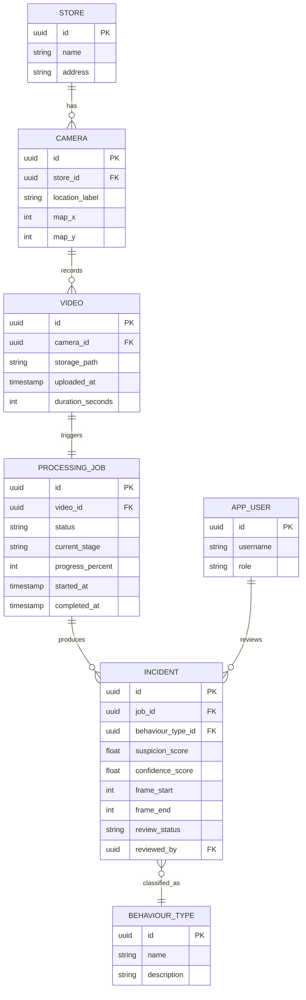

# Virtual Guard — Architecture Reference

**Project type:** AI-assisted retail surveillance platform (prototype)
**Duration:** 14-week university capstone
**Status:** Living document — updated as design decisions are made

---

## 1. Vision

Virtual Guard analyzes surveillance video using computer vision and machine learning to flag customer behaviour that warrants human security review. The system never makes accusations or determines guilt. For every analyzed clip it produces:

- Behaviour analysis
- Suspicion score
- Confidence score
- Human review recommendation

The final decision always belongs to a human security officer. This principle is enforced structurally, not just described in prose — see §6 (`INCIDENT.review_status`) and §10 (Incident Management).

**Long-term goal:** continuous multi-camera live CCTV monitoring with real-time alerting.

**Current prototype scope:** upload up to 4 surveillance videos simultaneously, each representing a different camera location (Entrance, Aisle A, Checkout, Storage), simulating a Security Operations Center.

---

## 2. Tech stack

| Layer | Technology |
|---|---|
| Frontend | React, TypeScript, Tailwind CSS |
| Backend | Java, Spring Boot |
| AI service | Python, FastAPI, OpenCV, YOLOv8n, simple prototype tracker, custom behaviour classifier |
| Database | PostgreSQL |

**Implementation note:** The current prototype uses a lightweight nearest-box
tracker (`SimpleTracker`). ByteTrack remains a planned upgrade for reliable
multi-object identity across occlusion and longer sequences.

**Dependency direction:** React → Spring Boot → PostgreSQL, and Spring Boot → FastAPI. React never calls FastAPI directly. FastAPI never touches PostgreSQL directly. Spring Boot is the single source of truth and the only service both PostgreSQL and FastAPI are aware of.

---

## 3. High-level system architecture

```
        React frontend
   (upload UI, dashboards)
             |
             v
      Spring Boot API
   (business logic, auth)
        /          \
       v            v
  PostgreSQL    FastAPI AI service
  (videos,      (YOLO11, ByteTrack,
   incidents,    behaviour classifier)
   users)             |
        ^______________|
        (async job dispatch + callback)
```

**Key architectural decision:** Spring Boot ↔ FastAPI communication is **asynchronous**, not a blocking synchronous REST call. Video analysis takes longer than an HTTP request should reasonably block on, and the prototype must support 4 concurrent uploads.

**Flow:**
1. User uploads video(s) → React → Spring Boot.
2. Spring Boot stores the file, creates a `VIDEO` row and a `PROCESSING_JOB` row (`status = QUEUED`), returns `202 Accepted` immediately.
3. Spring Boot calls FastAPI `/analyze` — a fire-and-forget dispatch (short timeout, just confirms acceptance), not a wait for full results.
4. FastAPI runs the pipeline (see §8), periodically POSTing progress updates back to Spring Boot, then a final POST with results on completion.
5. Spring Boot persists results, creates `INCIDENT` rows, flips job to `COMPLETE`.
6. Frontend polls active jobs (~1.5s interval) to drive the live progress UI (frame extraction → detection → tracking → behaviour analysis → scoring → result, matching the target dashboard).

**V1 vs V2:** polling is sufficient and matches the target UI's per-stage progress bars. WebSocket/SSE push is a clean, well-justified V2 improvement — lower latency, less wasted traffic at scale — and is a natural stepping stone toward real-time CCTV (§13).

---

## 4. Component breakdown — Spring Boot

Layered architecture with one deliberate addition: a **job orchestrator** component, isolated from the rest of the service layer.

```
REST controllers (validate, map DTOs)
        |
        v
   Service layer (business logic)
      /        \
     v          v
Repository    Job orchestrator
layer         (enqueues jobs, receives
(JPA →         callbacks, calls FastAPI)
 PostgreSQL)
```

Both branches are called from the service layer — never directly from controllers.

**Design patterns used (name these explicitly in the report):**

| Pattern | Where |
|---|---|
| Strategy | `VideoStorageService` interface — local disk now, S3/MinIO swappable later |
| Facade | Job orchestrator hides queue/HTTP/retry mechanics behind `submitForAnalysis(video)` |
| DTO | Controllers never expose JPA entities directly |
| Repository | Spring Data JPA |
| Builder | Constructing incident/report objects with many optional fields |

### Package structure

```
com.virtualguard.backend/
├── controller/     REST endpoints — thin, no logic
├── service/        business logic
├── orchestrator/   job lifecycle, FastAPI client, webhook receiver
├── repository/     Spring Data JPA interfaces
├── entity/         JPA entities
├── dto/            request/response objects
├── mapper/         entity <-> DTO (e.g. MapStruct)
├── storage/         VideoStorageService + LocalDiskVideoStorageService
├── config/           security, CORS, async config
├── exception/         custom exceptions + @ControllerAdvice handler
└── security/           JWT filter, auth config
```

---

## 5. Video storage

- **V1 decision: local disk**, not object storage — simplest to defend for a 14-week capstone, and the storage boundary is designed to be swapped without touching anything else.
- Access goes through a `VideoStorageService` interface (`store`, `retrieve`, `delete`). Only `LocalDiskVideoStorageService` implements it in V1. Swapping to S3/MinIO later means adding one new implementation — nothing else in the system changes.
- **Layout:** `/data/videos/{jobId}/{cameraLocation}.mp4` — grouped per job, not a flat directory.
- **Never store raw video bytes in PostgreSQL** — only the file path/key on the `VIDEO` record.
- Enforce a max upload size at the Spring Boot layer (`spring.servlet.multipart.max-file-size`) — resource-exhaustion protection, worth a line in the security section.
- Decide and document a retention/cleanup policy (delete after processing vs retain for audit) — affects disk growth and is a legitimate compliance talking point.

---

## 6. Database design

### Entity-relationship model

```
STORE (1) ---- (many) CAMERA
CAMERA (1) ---- (many) VIDEO
VIDEO (1) ---- (1) PROCESSING_JOB
PROCESSING_JOB (1) ---- (many) INCIDENT
INCIDENT (many) ---- (1) BEHAVIOUR_TYPE
APP_USER (1) ---- (many) INCIDENT   [as reviewer]
```



### Key design decisions

- `CAMERA.map_x` / `map_y` exist specifically to drive the store-map UI — no separate coordinate system needed.
- `PROCESSING_JOB` is separate from `VIDEO` so the async pipeline is representable in the schema. `current_stage` + `progress_percent` were added after reviewing the target UI, which shows live per-stage progress (Extracting Frames → Detecting People → Tracking Individuals → Behaviour Analysis → Calculating Score → Generating Result) — FastAPI POSTs intermediate stage updates, not just a final callback.
- `INCIDENT` is 1-to-many from `PROCESSING_JOB` — one video can surface multiple distinct suspicious moments, each with its own frame range, score, and reviewer.
- `review_status` and `reviewed_by` live on `INCIDENT` — this is the schema-level enforcement of the human-in-the-loop principle.
- `BEHAVIOUR_TYPE` is a lookup table, not a hardcoded enum — new behaviour categories can be added without a migration, and gives the classifier a stable target vocabulary.
- **Recommended indexes:** `INCIDENT(review_status, created_at)` — covers both the notification count query and the History page's default sort.

**Scoped out of V1 (name these explicitly as V2 roadmap items):** multi-tenant organization modeling, video retention policy tables, per-action audit-log tables.

---

## 7. REST API design (V1)

| Method & path | Purpose |
|---|---|
| `POST /api/videos/upload` | Upload up to 4 videos tagged to camera locations; creates `VIDEO` + `PROCESSING_JOB` rows |
| `POST /api/jobs/{id}/start` | Triggers analysis — calls FastAPI `/analyze` |
| `GET /api/jobs?status=active` | Polled by dashboard; returns in-flight jobs with `current_stage` + `progress_percent` |
| `GET /api/jobs/{id}` | Single job detail ("View Details") |
| `POST /internal/jobs/{id}/progress` | **Internal only** — FastAPI updates stage/progress mid-pipeline |
| `POST /internal/jobs/{id}/callback` | **Internal only** — FastAPI delivers final incidents, completes job |
| `GET /api/incidents?status=pending_review` | Feeds alerts/history views |
| `PATCH /api/incidents/{id}/review` | Officer confirms/dismisses/escalates — the human-in-the-loop action |
| `GET /api/cameras` | Store map pins + live status per camera |
| `GET /api/analytics/summary` | Active alerts, avg confidence, cameras online |
| `GET /api/notifications/count` | Bell badge count — derived from pending-review incidents, not a separate table |
| `POST /api/auth/login` / `POST /api/auth/refresh` | JWT issuance |

**Important boundary:** `/internal/jobs/{id}/progress` and `/internal/jobs/{id}/callback` are authenticated by a dedicated internal API-key filter, not by frontend user JWTs (see §8).

---

## 8. Authentication architecture

```
Login form (React)
        |
        v
Auth service (Spring Boot)
  verify hash, issue JWT
        |
        v
Frontend attaches JWT
  as Bearer token
        |
        v
JWT filter validates,
  checks role, per request
```

Internal FastAPI → Spring Boot calls (`/internal/jobs/{id}/progress`, `/internal/jobs/{id}/callback`) use a **separate shared-secret header** (`X-API-Key`), validated by `InternalApiKeyFilter` before controller validation — never a user JWT. The AI service derives these callback URLs from `SPRING_BOOT_URL` and the validated job UUID; request callers cannot choose an arbitrary callback host.

**Best practices:**
- BCrypt password hashing (cost factor ≥10)
- Access token (short-lived, ~15 min) + refresh token pair, refresh token rotates on use
- Stateless JWT validation — no server-side session store, enables horizontal scaling
- Rate-limit `/api/auth/login`
- CORS locked to the known frontend origin
- Method-level authorization (`@PreAuthorize("hasRole('SECURITY_OFFICER')")`) rather than only URL-pattern security

**Roles** (from `APP_USER.role`, matching the target UI's "Admin User / Security Team" label): at minimum `ADMIN` and `SECURITY_OFFICER`. Camera configuration is admin-only; incident review requires either role.

**V1 vs V2:** static shared secret in config is fine for V1. mTLS or short-lived service tokens from a secrets manager is a clean V2 line.

---

## 9. Store map and camera management

```
Camera configuration (admin sets location, map x/y)
        |
        v
CAMERA table (PostgreSQL)
        |
        v
Status aggregation (latest unreviewed incident per camera)
        |
        v
Store map pin (frontend) — green / amber / red
```

**Status computation** (dedicated `CameraStatusService`, not inline controller logic):
```
for each camera:
  latest = most recent INCIDENT for that camera, ordered by suspicion_score desc / detected_at desc
  if no pending incident recently        -> GREEN  (normal)
  elif pending and suspicion_score < T   -> AMBER  (review)
  elif pending and suspicion_score >= T  -> RED    (alert)
  else (already reviewed)                -> GREEN
```

**Endpoints:**

| Method & path | Purpose |
|---|---|
| `GET /api/cameras` | List with computed status (map + live monitoring grid) |
| `POST /api/cameras` | Register camera + location + coordinates |
| `PATCH /api/cameras/{id}` | Update label/coordinates |
| `DELETE /api/cameras/{id}` | Soft-delete — preserve historical incident data |

**Frontend rendering:** absolutely-positioned pins over a static floor-plan asset for V1 — no mapping library needed. Configurable/uploadable floor plans are a V2 item.

---

## 10. Incident management & analytics architecture

**State machine** (owned by `IncidentReviewService`, not driven by arbitrary frontend input):
```
PENDING_REVIEW -> CONFIRMED   (officer agrees, escalate to store security)
PENDING_REVIEW -> DISMISSED   (false positive)
PENDING_REVIEW -> ESCALATED   (flagged for further investigation)
```
Timestamp and log every transition for audit purposes.

**Notification bell:** derived, not a separate table in V1 — `COUNT(*) FROM INCIDENT WHERE review_status = 'PENDING_REVIEW'`, polled alongside job status. A dedicated notifications table with per-user read state is a clean V2 item once multiple officers need independent read state.

**One table, four views** (all query `INCIDENT`, differently):

| Dashboard page | Query shape | Notes |
|---|---|---|
| Live Monitoring | `job.status = PROCESSING` / recent jobs | Drives camera cards + map |
| History | Date range + camera/type filters, paginated | Index on `created_at`, `camera_id`, `review_status` |
| Analytics | `GROUP BY` aggregations — per day, per behaviour type, per camera, avg confidence | Read-heavy; consider a nightly rollup table (`daily_incident_summary`) as data grows |
| Reports | Analytics queries over a fixed range, exported to PDF/CSV | Async export — same pattern as async video processing, for consistency |

---

## 11. Not yet designed (next sections)

- Docker / deployment architecture
- Sequence diagrams
- Class diagrams
- Use case diagrams
- Security considerations (consolidated)
- Scalability
- Error handling
- Logging
- Testing strategy
- CI/CD recommendations
- Future real-time CCTV architecture (V2 roadmap)
- Future Version 2 roadmap (consolidated)

This file will be updated as each of these is designed.
